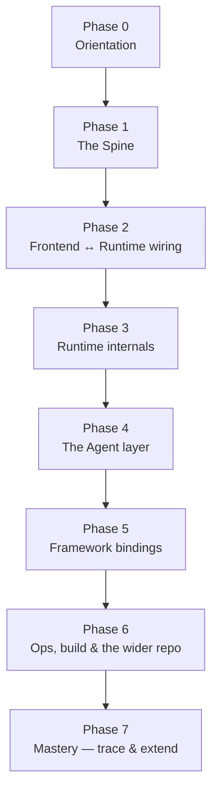

# Learning Roadmap

A staged path for going from zero to fluent in the **CopilotKit** codebase using this vault. Each phase has a **goal**, an ordered **reading list** (all links resolve to notes here), a **checkpoint** (what you should be able to explain or do), and a small **exercise** to make it stick. Work top to bottom — later phases assume the earlier ones.

For the orientation map see [[🗺️ Home]]; for terse definitions see [[Glossary]]; for the curated concept index see [[Concepts MOC]].

---

## Phase 0 — Orientation (½ day)

**Goal:** Know what CopilotKit *is*, how this vault is laid out, and how to navigate it.

1. [[🗺️ Home]] — the top-level map and the 20-package inventory.
2. [[Glossary]] — skim every term once so the vocabulary is familiar.
3. [[Concepts MOC]] — the reading order the rest of this roadmap follows.

Also learn the **vault mechanics**: open the **Graph view** (color-grouped by `#layer/*`), browse the 4 boards in `_canvas/`, and note the tag scheme (`#layer/*`, `#type/*`, `#pkg/*`, all under `#copilotkit`).

**Checkpoint:** You can name the three layers and say which `packages/` directories belong to each.
**Exercise:** From the Graph view, find one note in each layer color and open it.

---

## Phase 1 — The Spine (1 day)

**Goal:** Internalize the architecture and the one protocol that ties it together. This is the most important phase — everything else hangs off it.

1. [[Three-Layer Architecture]] — Frontend → Runtime → Agent, each independently swappable.
2. [[AG-UI Protocol]] — the event-based SSE wire format all three layers speak. **The keystone.**
3. [[Request Lifecycle]] — what happens end-to-end when a user sends a message.
4. [[@copilotkit vs @copilotkitnext]] — the two npm scopes and which is built here vs published externally.

**Checkpoint:** You can draw the path of a single user message from the browser to the agent and back, naming the protocol at each hop, and explain *why the frontend never calls the LLM directly* (the runtime is the trust + protocol boundary).
**Exercise:** Sketch the lifecycle from memory, then check it against [[Request Lifecycle]].

---

## Phase 2 — Frontend ↔ Runtime wiring (1–2 days)

**Goal:** Understand how the client forwards runs and the core interaction primitives (tools, context, threads).

1. [[ProxiedAgent]] — the frontend `AbstractAgent` ([[core - ProxiedCopilotRuntimeAgent]]) that forwards runs over the wire.
2. [[Intelligence Platform vs SSE]] — the two transport modes and the client's auto-detection.
3. [[Tools (Frontend & Backend)]] — how tool calls round-trip between layers (the central pattern).
4. [[Context]] — readable app state injected into every run.
5. [[Threads]] — durable conversation grouping + history replay.
6. [[Suggestions]] — dynamic/static next-message suggestions.
7. [[@copilotkit/core]] — the framework-agnostic orchestrator ([[core - CopilotKitCore]]) that every binding wraps.

**Checkpoint:** You can explain what a frontend tool is, where it executes, and how its result gets back to the agent — versus a backend tool.
**Exercise:** Trace a single frontend tool call through [[Tools (Frontend & Backend)]] and [[Request Lifecycle]].

---

## Phase 3 — Runtime internals (2 days)

**Goal:** Understand the server: how it executes agents, applies middleware, and renders generative UI. Confront the **dual V1/V2 architecture** of `@copilotkit/runtime` head-on — it's the single most confusing part of the codebase.

1. [[@copilotkit/runtime]] — start at the overview; note the V1 (GraphQL + 9 LLM adapters) vs V2 (`CopilotRuntime`, fetch handler) split.
2. [[AgentRunner]] — the abstraction that executes/streams a run (InMemory / SQLite / AgentCore / Intelligence).
3. [[runtime - createCopilotRuntimeHandler]] — the `(Request) => Promise<Response>` entry point.
4. [[Middleware]] — before/after request hooks + auto-applied agent middleware.
5. [[A2UI (Generative UI)]] — agent-driven UI rendering and its three UI middlewares.
6. [[Multi-Agent]] — many agents under one runtime, routed by `agentId`.

**Checkpoint:** You can explain the difference between the V1 and V2 runtime, and what an `AgentRunner` implementation must provide.
**Exercise:** List the four `AgentRunner` implementations and say what each is for.

---

## Phase 4 — The Agent layer (1–2 days)

**Goal:** Understand the thing that actually reasons — the built-in agent and external frameworks.

1. [[runtime - BuiltInAgent]] — the Vercel AI SDK agent that lives *inside* `packages/runtime/src/agent/` (remember: **there is no `packages/agent`**).
2. [[@copilotkit/sdk-js]] — the JS/TS agent SDK (LangGraph utilities, CopilotKit middleware, zod state).
3. [[@copilotkit/demo-agents]] — minimal reference agents used by demos/tests.
4. [[SDK-Python MOC]] — the Python `copilotkit` SDK (LangGraph / CrewAI / FastAPI), if you'll work server-side in Python.

**Checkpoint:** You can describe two ways to plug an agent into the runtime (built-in vs external via SDK/adapter).
**Exercise:** Compare a `demo-agents` agent to the `BuiltInAgent` and note what each must implement to speak AG-UI.

---

## Phase 5 — Framework bindings (pick your stack, 1–2 days)

**Goal:** See how a UI framework wraps [[@copilotkit/core]]. Read the binding you'll actually use; skim the others.

- [[@copilotkit/react-core]] — React provider, hooks, V1 + V2 chat components.
- [[@copilotkit/react-ui]] — prebuilt React chat UI (Chat / Popup / Sidebar / Modal, dev-console).
- [[@copilotkitnext/angular]] — signal-based Angular bindings (the only `@copilotkitnext/*` built from this repo).
- [[@copilotkit/vue]] — Vue 3 composables + components.
- [[@copilotkit/a2ui-renderer]] — the framework-agnostic generative-UI renderer behind [[A2UI (Generative UI)]].

**Checkpoint:** For your chosen framework, you can wire up a provider, register a frontend tool, and inject context.
**Exercise:** In your binding's overview note, find the hook/composable/service that registers a frontend tool and trace it down to [[core - CopilotKitCore]].

---

## Phase 6 — Ops, build & the wider repo (1 day)

**Goal:** Be able to run, debug, and ship.

1. [[Debug Mode]] + [[DebugConfig]] — granular event/lifecycle logging and how config is normalized.
2. [[Telemetry & Licensing]] — anonymous telemetry, opt-out, license gating.
3. [[Build-CI-Release MOC]] — Nx, pnpm workspace, changesets, the two release tracks, 37 workflows.
4. [[Apps MOC]] + [[Examples MOC]] — the `showcase/` platform and the runnable example projects.
5. [[Docs-Site MOC]] — the Fumadocs docs site, if you'll touch docs.

**Checkpoint:** You can turn on debug logging, find the relevant CI workflow for a change, and locate an example that exercises the feature you're working on.
**Exercise:** Pick one example from [[Examples MOC]] and identify every CopilotKit package it depends on.

---

## Phase 7 — Mastery: trace & extend

**Goal:** Prove fluency by following real flows end-to-end and reasoning about changes.

- **Trace 1 — generative UI:** user message → tool call → [[A2UI (Generative UI)]] renders a component, across [[Request Lifecycle]], [[Tools (Frontend & Backend)]], and your binding.
- **Trace 2 — persistence:** a run that resumes from history via [[Threads]] and a persistent [[AgentRunner]] (e.g. `sqlite-runner`).
- **Trace 3 — transport switch:** the same client against both [[Intelligence Platform vs SSE]] modes.
- **Design exercise:** decide where a new feature would live — which layer, which package, V1 or V2 — and which notes you'd update.

**Checkpoint:** Given a feature request, you can name the layer, package, and symbols you'd touch, and explain the AG-UI events involved — without re-reading the spine.

---

## Quick reference — the three things people get wrong

Keep these straight from day one (see [[@copilotkit vs @copilotkitnext]] and the package overviews):

1. **There is no `packages/agent`.** The `BuiltInAgent` lives in `packages/runtime/src/agent/` — see [[runtime - BuiltInAgent]].
2. **`@copilotkit/runtime` is dual-architecture** — legacy GraphQL **V1** *and* fetch-based **V2** coexist.
3. **`@copilotkitnext/{react,agent,runtime}`** are published externally; only **`@copilotkitnext/angular`** is built from this repo.
