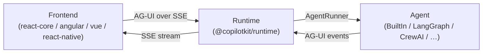

# 🗺️ Home

Top-level map for the **CopilotKit** knowledge base. This vault documents the CopilotKit monorepo at file/symbol depth — every note is grounded in the actual source, not the (stale) repo docs.

## What is CopilotKit?

CopilotKit is an **AI-agent framework** that lets you embed copilots and agents into your app. It is organized as three layers that talk to each other over a single event-based wire protocol:

**Frontend → Runtime → Agent**, all speaking the **[[AG-UI Protocol]]** (event-based SSE).

- **Frontend** — React / Angular / Vue / React Native / vanilla bindings that render chat + generative UI, register frontend tools, inject [[Context]], and forward runs to the runtime via a [[ProxiedAgent]]. Built on the framework-agnostic [[@copilotkit/core]] orchestrator.
- **Runtime** — an Express/Hono/Node server ([[@copilotkit/runtime]]) that receives runs, applies [[Middleware]], and drives an agent through the [[AgentRunner]] abstraction, streaming AG-UI events back over SSE.
- **Agent** — the thing that actually reasons: the built-in Vercel-AI-SDK agent, or an external framework (LangGraph, CrewAI, Mastra, …) reached through an adapter or the Python/JS SDKs.

See **[[Three-Layer Architecture]]** for the full spine and **[[Request Lifecycle]]** for what happens end-to-end when a user sends a message.

## Areas

- [[Concepts MOC]] — cross-cutting architecture concepts (the layers, AG-UI, lifecycle, tools, context, multi-agent, middleware, telemetry). **Start here.**
- [[Apps MOC]] — the `showcase/` platform: per-framework demo apps, shell apps, harness, scripts, and integration backends.
- [[Examples MOC]] — the example projects under `examples/` (canvas, integrations, showcases, v1/v2 starters, e2e).
- [[SDK-Python MOC]] — the Python `copilotkit` SDK (LangGraph / CrewAI integrations, protocol, runloop, FastAPI).
- [[Docs-Site MOC]] — the Fumadocs documentation site (`showcase/shell-docs`) and dev-docs.
- [[Build-CI-Release MOC]] — Nx, pnpm workspace, lefthook, commitlint, changesets, release pipeline, GitHub workflows, npm OIDC.
- [[Config Packages MOC]] — the shared TypeScript/Tailwind config packages.

## Packages (20)

All packages live flat under `packages/`. Grouped here by the layer each one serves.

### Shared
- [[@copilotkit/shared]] — cross-cutting types, message/parameter/action types, telemetry, [[DebugConfig]], schema utilities, attachments.

### Frontend
- [[@copilotkit/core]] — the framework-agnostic frontend orchestrator (agent/tool/context registries, run handling, state). Wrapped by every binding below.
- [[@copilotkit/react-core]] — React provider, hooks, and chat components (V1 + V2).
- [[@copilotkit/react-ui]] — prebuilt React chat UI (CopilotChat / Popup / Sidebar / Modal, dev-console).
- [[@copilotkit/react-textarea]] — AI-autocompleting textarea built on Slate.
- [[@copilotkit/react-native]] — React Native bindings (RN-safe headless subset + chat components).
- [[@copilotkitnext/angular]] — Angular bindings (signal-based service, chat components, directives). *Published independently as `@copilotkitnext/angular`.*
- [[@copilotkit/vue]] — Vue 3 bindings (composables, providers, chat components, A2UI surface).
- [[@copilotkit/a2ui-renderer]] — framework-agnostic [[A2UI (Generative UI)]] renderer (catalogs, Zustand store, React adapter).
- [[@copilotkit/web-inspector]] — Lit web-component dev inspector for AG-UI threads/events.
- [[@copilotkit/runtime-client-gql]] — legacy GraphQL runtime client + AG-UI⇄GQL converters.

### Runtime
- [[@copilotkit/runtime]] — the dual-architecture server: V2 `CopilotRuntime` + [[AgentRunner]] + endpoints, plus the V1 GraphQL layer, 9 LLM service adapters, and the Vercel-AI-SDK **BuiltInAgent**.
- [[@copilotkit/voice]] — OpenAI Whisper transcription service.
- [[@copilotkit/sqlite-runner]] — SQLite-backed `AgentRunner` with run-chaining persistence.
- [[@copilotkit/agentcore-runner]] — AWS Bedrock AgentCore `AgentRunner`.

### Agent
- [[@copilotkit/sdk-js]] — JS/TS agent SDK (LangGraph utilities, CopilotKit middleware, zod state, action conversion).
- [[@copilotkit/demo-agents]] — sample agents (OpenAIAgent, SlowToolCallStreamingAgent) used by demos/tests.

### Config (tooling)
- [[typescript-config]] — shared `@copilotkit/typescript-config` tsconfig presets.
- [[tsconfig (legacy presets)]] — the older private tsconfig preset package (coexists with the above).
- [[tailwind-config]] — shared Tailwind preset.

## Reference

- [[Glossary]] — quick definitions of the key architecture concepts, linking into the [[Concepts MOC|Architecture notes]].
- [[@copilotkit vs @copilotkitnext]] — which scope is built in this repo vs published externally.
