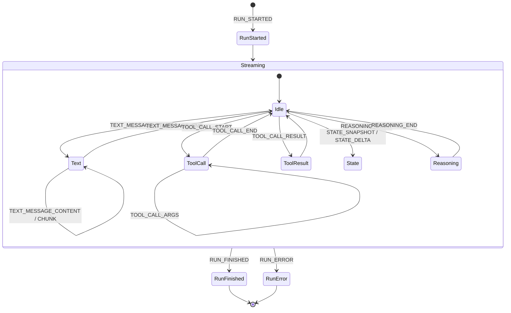

# AG-UI Protocol

AG-UI is the event-based wire format that connects all three layers of the [[Three-Layer Architecture]]. It is defined by the external `@ag-ui/*` packages (`@ag-ui/client`, `@ag-ui/core`, `@ag-ui/encoder`, …) which CopilotKit consumes — it is **not** defined in this repo. CopilotKit's job is to speak it on both ends: the frontend's [[ProxiedAgent]] emits/consumes AG-UI events, and the runtime normalizes any agent backend into the same event stream.

## Shape

A run is an ordered stream of `BaseEvent` objects, each with a `type` from the `EventType` enum (imported throughout CopilotKit code, e.g. `packages/core/src/core/run-handler.ts` and `packages/runtime/src/v2/runtime/runner/in-memory.ts`). The events observed in CopilotKit's own code:

- **Run lifecycle:** `RUN_STARTED`, `RUN_FINISHED`, `RUN_ERROR`.
- **Steps:** `STEP_STARTED`, `STEP_FINISHED`.
- **Text messages:** `TEXT_MESSAGE_START`, `TEXT_MESSAGE_CONTENT`, `TEXT_MESSAGE_CHUNK`, `TEXT_MESSAGE_END`.
- **Tool calls:** `TOOL_CALL_START`, `TOOL_CALL_ARGS`, `TOOL_CALL_END`, `TOOL_CALL_RESULT` (drives [[Tools (Frontend & Backend)]]).
- **State:** `STATE_SNAPSHOT`, `STATE_DELTA` (JSON-patch deltas), `MESSAGES_SNAPSHOT`.
- **Reasoning:** `REASONING_START`, `REASONING_MESSAGE_START/CONTENT/END`, `REASONING_END`.
- **Custom / raw:** `CUSTOM`, `RAW`.

On the runtime, events are serialized to SSE by AG-UI's `EventEncoder` ([[runtime - SSE Streaming]]; see `packages/runtime/src/v2/runtime/handlers/shared/sse-response.ts`). On the frontend they are parsed back via AG-UI's `transformHttpEventStream` ([[core - ProxiedCopilotRuntimeAgent]]).

## Run lifecycle as a state machine

## Guarantees CopilotKit adds

A backend can disconnect mid-stream. Before storing/forwarding a run, the runtime calls `finalizeRunEvents` ([[@copilotkit/shared]], `packages/shared/src/finalize-events.ts`) to synthesize the terminal events any open messages/tool-calls are missing and to append a `RUN_ERROR` (or stop message) so consumers always see a well-formed close. AG-UI's `compactEvents` is used when persisting/replaying a thread so a late-joining client ([[Threads]], [[runtime - InMemoryAgentRunner]]) sees a consolidated stream.

## Transports

The same events flow over two HTTP shapes (see [[Request Lifecycle]] and [[runtime - Routing & CORS]]):
- **Multi-route REST:** `POST /agent/:agentId/run`, `/connect`, `/stop/:threadId`, plus `GET /info`, `/threads...`.
- **Single-route:** one `POST` endpoint taking a JSON envelope `{ method, params, body }`.

Both are auto-detected by the client via `GET /info` ([[core - ProxiedCopilotRuntimeAgent]] `fetchRuntimeInfoAutoDetect`). For the durable/realtime variant see [[Intelligence Platform vs SSE]].
