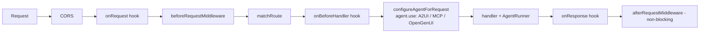

# Middleware

The runtime offers **two distinct extension surfaces**, which are easy to confuse. Both live in [[@copilotkit/runtime]] (V2).

## 1. Request middleware (before / after)

Function hooks around the whole HTTP request, configured on `CopilotRuntime` ([[runtime - CopilotRuntime (v2)]]) and invoked inside `createCopilotRuntimeHandler` ([[runtime - createCopilotRuntimeHandler]], [[Request Lifecycle]]). Defined in `packages/runtime/src/v2/runtime/core/middleware.ts` ([[runtime - Middleware (v2)]]):

- `beforeRequestMiddleware({ runtime, request, path })` — may return a modified `Request` (e.g. auth, header rewriting). Runs before routing.
- `afterRequestMiddleware({ runtime, response, path, messages?, threadId?, runId? })` — runs **non-blocking** after the handler; the runtime parses the SSE response (`parseSSEResponse`) and hands the middleware the reconstructed messages + thread/run ids for logging/persistence. It reads a *cloned* response so the client stream is untouched.

In the current code both are **in-process callbacks**; the doc comments mention a webhook-URL form but `callBeforeRequestMiddleware`/`callAfterRequestMiddleware` only execute the function variant and warn-and-skip otherwise.

## 2. Lifecycle hooks

A separate `hooks` object on the handler (`packages/runtime/src/v2/runtime/core/hooks.ts`, [[runtime - Hooks & Debug Event Bus]]): `onRequest`, `onBeforeHandler`, `onResponse`, `onError`. These receive a `RouteInfo` and are the finer-grained, route-aware extension points the handler pipeline calls in order.

## 3. Agent (AG-UI) middleware — auto-applied per run

Distinct from request middleware: these are **AG-UI middlewares** wrapped around the *agent* itself, attached per-request by `configureAgentForRequest` (`agent.use(...)`) when the corresponding runtime option is set (`packages/runtime/src/v2/runtime/handlers/shared/agent-utils.ts`):

- **`A2UIMiddleware`** (`@ag-ui/a2ui-middleware`) when `runtime.a2ui` is set → [[A2UI (Generative UI)]].
- **`MCPAppsMiddleware`** (`@ag-ui/mcp-apps-middleware`) when `runtime.mcpApps.servers` is set → attaches MCP tool servers ([[Tools (Frontend & Backend)]]).
- **`OpenGenerativeUIMiddleware`** (local, `open-generative-ui-middleware.ts`) when `runtime.openGenerativeUI` is set.

Each honors an `agents` / `agentId` allowlist so it only wraps the targeted agents in a [[Multi-Agent]] runtime.

The Python SDK has its own agent-side middleware concept — see [[sdk-js - createCopilotkitMiddleware]] and [[sdk-python - CopilotKitMiddleware]].
