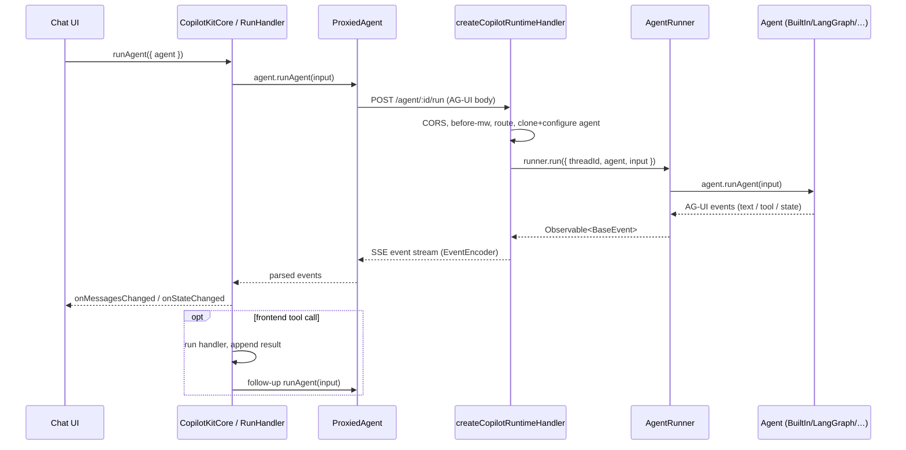

# Request Lifecycle

End-to-end path of a single agent run in the default SSE mode (see [[Intelligence Platform vs SSE]] for the durable variant). This is the concrete realization of the [[Three-Layer Architecture]] over the [[AG-UI Protocol]].

## Frontend → Runtime

1. UI calls `copilotkit.runAgent({ agent })` on [[core - CopilotKitCore]], which delegates to [[core - RunHandler]].
2. RunHandler builds a `RunAgentInput` (messages, [[Context]], frontend [[Tools (Frontend & Backend)]] descriptions, `forwardedProps`) and calls `agent.runAgent(...)` on the [[ProxiedAgent]] ([[core - ProxiedCopilotRuntimeAgent]]).
3. The proxy issues an HTTP request to the runtime — `POST /agent/:agentId/run` (REST) or a single-route envelope. It auto-detects which by first hitting `GET /info`.

## Inside the runtime

`createCopilotRuntimeHandler` ([[runtime - createCopilotRuntimeHandler]]) runs a fixed pipeline (`packages/runtime/src/v2/runtime/core/fetch-handler.ts`):

1. CORS preflight ([[runtime - Routing & CORS]]).
2. `onRequest` hook → legacy `beforeRequestMiddleware` ([[Middleware]]).
3. Route match (`matchRoute`) → HTTP-method validation.
4. `onBeforeHandler` hook → dispatch to the matched handler.
5. For `agent/run`: `handleRunAgent` ([[runtime - Handlers (run/connect/stop)]]) clones the named agent (`cloneAgentForRequest`), applies auto-middleware ([[A2UI (Generative UI)]] / MCP / OpenGenUI via `configureAgentForRequest`), forwards request headers, parses+validates the body (`RunAgentInputSchema`), and seeds the agent's messages/state/threadId.
6. It hands off to `handleSseRun`, which calls `runtime.runner.run({ threadId, agent, input })` ([[AgentRunner]]).
7. `createSseEventResponse` ([[runtime - SSE Streaming]]) subscribes to that observable, encodes each AG-UI event with AG-UI's `EventEncoder`, and writes them to a `TransformStream` returned as `text/event-stream`. It also broadcasts to the [[runtime - Hooks & Debug Event Bus]] and logs per [[Debug Mode]].
8. `onResponse` hook → CORS headers → non-blocking `afterRequestMiddleware` (reads a cloned response).

## Agent execution

The [[runtime - InMemoryAgentRunner]] (default) calls `agent.runAgent(input, …)` — the agent (e.g. [[runtime - BuiltInAgent]]) streams AG-UI events, which the runner relays into both the run observable and a per-thread store (for replay), then appends `finalizeRunEvents` to guarantee a clean close, and records the run for [[Threads]] history.

## Runtime → Frontend

The proxy's SSE pipeline parses events back into AG-UI `BaseEvent`s; [[core - StateManager]] tracks state/run bookkeeping and the agent's subscribers fire `onMessagesChanged`/`onStateChanged`, re-rendering the UI.

## Tool round-trip & follow-up

If the stream contains a `TOOL_CALL_*` for a registered **frontend** tool, [[core - RunHandler]] executes the handler locally, appends the tool-call + result messages, and — when configured — triggers a **follow-up** `runAgent` so the LLM can respond to the result. (`waitForPendingFrameworkUpdates()` yields to the framework scheduler first so the follow-up reads fresh [[Context]].) Backend tools resolve entirely server-side. See [[Tools (Frontend & Backend)]].

