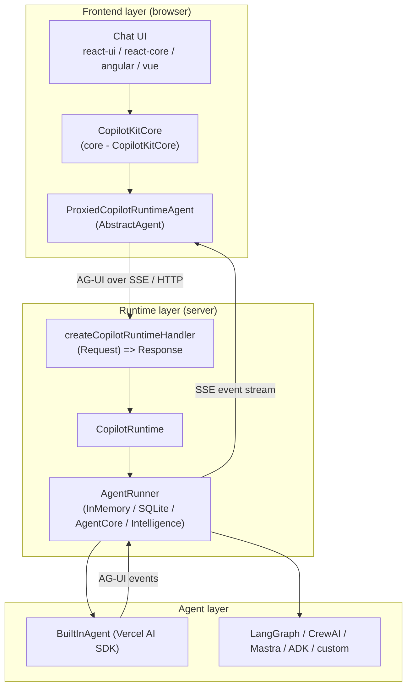

# Three-Layer Architecture

CopilotKit is organized into three layers that communicate exclusively over the [[AG-UI Protocol]] (event-based SSE). Each layer is swappable independently.

1. **Frontend** — UI + client orchestration. Framework bindings ([[@copilotkit/react-core]], [[@copilotkitnext/angular]], [[@copilotkit/vue]], [[@copilotkit/react-native]]) all wrap the framework-agnostic [[@copilotkit/core]] orchestrator ([[core - CopilotKitCore]]). The frontend owns the chat UI, frontend [[Tools (Frontend & Backend)]], [[Context]], and [[Suggestions]].
2. **Runtime** — a server ([[@copilotkit/runtime]]) that receives AG-UI requests, resolves the named agent, runs it through an [[AgentRunner]], and streams events back. It is framework-agnostic at its core (`createCopilotRuntimeHandler` is a `(Request) => Promise<Response>`; see [[runtime - createCopilotRuntimeHandler]]) with thin adapters for Express/Hono/Node.
3. **Agent** — the thing that actually produces tokens and tool calls. Can be the built-in Vercel AI SDK agent ([[runtime - BuiltInAgent]]), a LangGraph/CrewAI/Mastra/ADK agent via integrations, or any custom `AbstractAgent`. The Python side lives in the [[SDK-Python MOC|Python SDK]].

Importantly, the frontend does **not** talk to the LLM directly in production. The browser holds a [[ProxiedAgent]] ([[core - ProxiedCopilotRuntimeAgent]]) that forwards each run to the runtime; the runtime holds the real agent and provider credentials.

**Why this split:** the runtime is the trust boundary (credentials, [[Telemetry & Licensing]], [[Middleware]]) and the protocol boundary (it normalizes any agent backend into AG-UI events), so the same frontend works against any agent framework. See [[Request Lifecycle]] for the step-by-step flow and [[Intelligence Platform vs SSE]] for the two runtime modes.

Layer ownership in this repo: frontend = `packages/{core,react-core,react-ui,vue,angular,react-native,react-textarea}`; runtime = `packages/runtime` (+ runner packages `sqlite-runner`, `agentcore-runner`); agent = `packages/{demo-agents,sdk-js}` and the Python SDK. See [[@copilotkit vs @copilotkitnext]] for the published-scope nuance.
