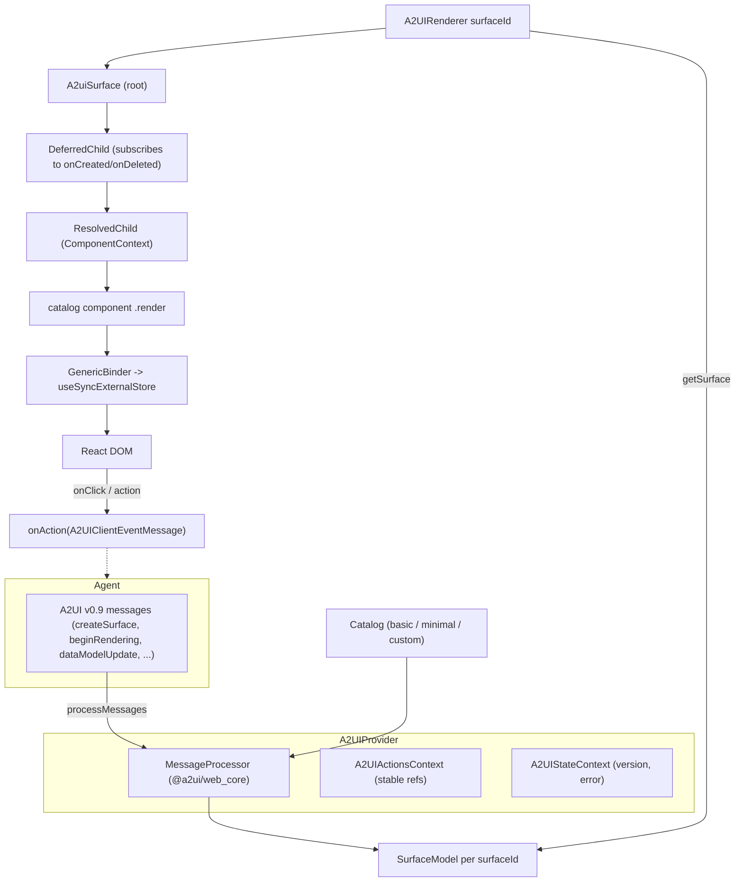

# @copilotkit/a2ui-renderer

React renderer for **A2UI** agent-generated UI surfaces. Given a stream of A2UI v0.9 messages (server→client UI operations), it materializes a live React component tree from a **catalog** of components, and routes user interactions (button clicks, form input) back to the agent as action events. This is the React implementation of the [[A2UI (Generative UI)]] concept; the Vue counterpart lives in [[vue - A2UI (VueSurface/adapter/catalog)]] and the React-core wiring that feeds it is [[react-core - A2UI renderers]].

Published as `@copilotkit/a2ui-renderer` at **v1.57.4**, MIT, ESM+CJS. Built with **tsdown**, tested with **vitest**.

## What it is (and what it isn't)

The package is a thin CopilotKit-facing wrapper around the upstream **`@a2ui/web_core` v0.9** engine (`MessageProcessor`, `SurfaceModel`, `ComponentContext`, `GenericBinder`, `Catalog`). The heavy lifting — parsing messages, maintaining the data model, computing component props from data bindings — is done by `@a2ui/web_core`. This package provides:

1. A **React context provider** ([[a2ui-renderer - A2UIProvider & A2UIRenderer]]) holding a single `MessageProcessor`.
2. A **React adapter** ([[a2ui-renderer - createReactComponent adapter]]) that turns an A2UI `ComponentApi` into a React component subscribed to the binder.
3. A **deferred-children surface walker** ([[a2ui-renderer - A2uiSurface (deferred children)]]) that lazily mounts components as the agent streams them in.
4. Two ready-made **catalogs** ([[a2ui-renderer - basicCatalog]], [[a2ui-renderer - minimalCatalog]]) plus a typed **catalog builder** ([[a2ui-renderer - createCatalog]]) for custom components, and **catalog schema utilities** ([[a2ui-renderer - Catalog components]] cover the renderers; schema export lives in the builder/utils).

Many legacy v0.8 exports survive as **deprecated aliases or no-ops** for backward compatibility (see notes). The provider's "store" is plain React state/refs + two contexts, **not** Zustand — see [[a2ui-renderer - Zustand store]] for that correction.

## Entry points / exports

Single public entry `.` (`dist/index.{mjs,cjs}`, types `index.d.mts`). `src/index.ts` re-exports all of `react-renderer/index.ts` and adds `DEFAULT_SURFACE_ID`, `Theme`, `A2UIClientEventMessage` from `a2ui-types`. Public surface (from `react-renderer/index.ts`):

- Provider/renderer: `A2UIProvider`, `A2UIRenderer`, hooks `useA2UI`, `useA2UIActions`, `useA2UIState`, `useA2UIContext`, `useA2UIError`, deprecated `useA2UIStore`/`useA2UIStoreSelector`.
- Theme: `ThemeProvider`, `useTheme`, `useThemeOptional`.
- Catalog building: `createCatalog`, `extractSchema`, deprecated `createA2UICatalog`/`extractA2UISchema`; low-level `createReactComponent`, `basicCatalog`, re-exported `Catalog` from `@a2ui/web_core/v0_9`.
- Catalog/schema helpers: `A2UI_SCHEMA_CONTEXT_DESCRIPTION`, `extendsBasicCatalog`, `getCustomComponentNames`, `buildCatalogContextValue`, `extractCatalogComponentSchemas`.
- Styles no-ops: `injectStyles`, `removeStyles`; back-compat no-ops `registerDefaultCatalog`, `initializeDefaultCatalog`, and empty `defaultTheme`/`litTheme`.
- Types: the (mostly `any`) legacy aliases plus `OnActionCallback`, `A2UIProviderConfig`, etc. — see [[a2ui-renderer - a2ui-types]].

> Note: `src/A2UIViewer.tsx` exists but imports modules that no longer exist in v0.9 (`./react-renderer/registry/defaultCatalog`, `./react-renderer/theme/litTheme`, `@a2ui/lit`) and is **not** re-exported from the package `.` entry. Treat it as stale/dead code, not public API.

## Subsystems

- [[a2ui-renderer - A2UIProvider & A2UIRenderer]] — React context + surface mount point (`core/`).
- [[a2ui-renderer - Zustand store]] — the store shape (`core/store.ts`); correction: it is React-context state, not Zustand.
- [[a2ui-renderer - createReactComponent adapter]] — A2UI `ComponentApi` → React component via `GenericBinder` + `useSyncExternalStore`.
- [[a2ui-renderer - A2uiSurface (deferred children)]] — `DeferredChild`/`ResolvedChild` lazy tree walker.
- [[a2ui-renderer - createCatalog]] — typed definitions+renderers catalog builder and schema extraction.
- [[a2ui-renderer - basicCatalog]] — 18-component default catalog.
- [[a2ui-renderer - minimalCatalog]] — 5-component minimal catalog + a `capitalize` function.
- [[a2ui-renderer - Catalog components]] — the individual React component renderers.
- [[a2ui-renderer - a2ui-types]] — public/legacy type surface, `OnActionCallback`, theme/event types, catalog schema utilities.

## Architecture

## Key concepts implemented

- [[A2UI (Generative UI)]] — this is the React renderer half of it.
- [[AG-UI Protocol]] — A2UI messages ride the AG-UI event stream; the `@ag-ui/a2ui-middleware` (external) injects the catalog schema into agent context, which is why [[a2ui-renderer - a2ui-types]] exposes `A2UI_SCHEMA_CONTEXT_DESCRIPTION`.

## Depends on / depended on by

- **Depends on** (external, not in this repo): `@a2ui/web_core` (v0.9 engine), `zod`, `zod-to-json-schema`, `clsx`. Peer: `react`/`react-dom` (^18 || ^19).
- **Depended on by**: [[@copilotkit/react-core]] (its [[react-core - A2UI renderers]] mount `A2UIProvider`/`A2UIRenderer` to render agent UI inside chat). The Vue stack reimplements the same idea natively in [[vue - A2UI (VueSurface/adapter/catalog)]].

## Build / test

- Bundler: **tsdown** (`build` script). Type-check: `tsc --noEmit`.
- Tests: **vitest** (`src/__tests__/`), jsdom environment via `@testing-library/react`.
- `publint` + `attw` configured for package-export correctness.
