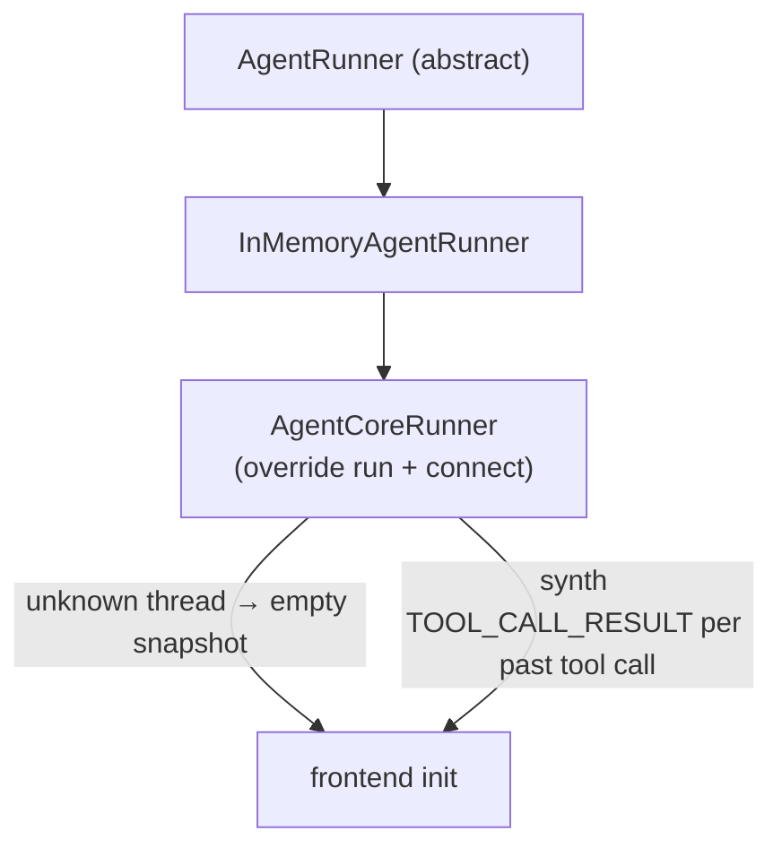

# @copilotkit/agentcore-runner

An [[AgentRunner]] tailored for **AWS Bedrock AgentCore**. AgentCore stores conversation history server-side (via its `AgentCoreMemorySaver` / `AgentCoreMemorySessionManager`), so on reconnect the CopilotKit frontend needs the [[AG-UI Protocol]] stream reshaped to match what it expects. This runner is a thin override of [[runtime - InMemoryAgentRunner]] that fixes two reconnection gaps.

Published as `@copilotkit/agentcore-runner` at **v1.57.4** (`package.json` description: "AWS Bedrock AgentCore-compatible agent runner for CopilotKit2"). ESM-first, single export (`.`). Built with **tsdown**, tested with **vitest**. `engines.node >= 18`.

## Exports

`src/index.ts` re-exports everything from `./agentcore-runner` — i.e. the `AgentCoreRunner` class.

## Dependencies

- `[[@copilotkit/runtime]]` (`workspace:*`) — `InMemoryAgentRunner` from `@copilotkit/runtime/v2` (the class it extends).
- `@ag-ui/client` (`0.0.53`) — `EventType`, `BaseEvent`, `Message`, `MessagesSnapshotEvent`, `ToolCall`, `ToolCallResultEvent`.
- `rxjs` (`7.8.1`) — `concatMap`, `Observable`, `of`.
- `node:crypto` — `randomUUID`.

> Note: the package name and description reference AWS Bedrock AgentCore, but the source code itself has **no AWS SDK dependency** — it only adapts the AG-UI event stream. The "AgentCore" coupling is in how the host wires its agent, not in this package's imports.

## Subsystem

- [[agentcore-runner - AgentCoreRunner]] — the single class, overriding `run()` and `connect()`.

## How it relates to the other runners

Unlike [[@copilotkit/sqlite-runner]] (which subclasses the abstract base and re-implements storage), `AgentCoreRunner` **extends `InMemoryAgentRunner`** and only patches reconnect behavior — all run/store/stop logic is inherited.

## Build/test

tsdown bundle, vitest (`test`, `test:coverage`), `publint` + `attw`. Tests in `packages/agentcore-runner/src/__tests__/`.
