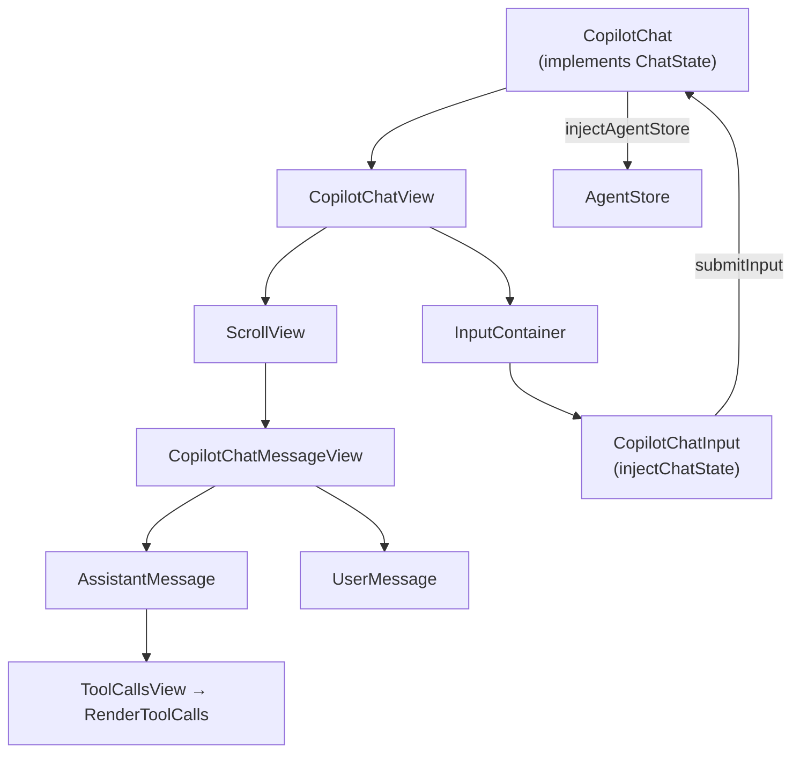

# angular - Chat components

The standalone-component chat UI of [[@copilotkitnext/angular]] — an Angular port of CopilotKit's React chat, with DOM structure and Tailwind classes deliberately matched to the React implementation. All components are `standalone: true` and overwhelmingly `ChangeDetectionStrategy.OnPush` with `ViewEncapsulation.None` (so the shared `styles.css` applies). Customization happens through [[angular - Slots]]. Tool-call rendering is delegated to [[angular - render-tool-calls]].

## Entry component: `CopilotChat`

Selector `copilot-chat` (`copilot-chat.ts`). The high-level "wire an agent to a chat view" component, equivalent to React's `<CopilotChat>`.

- Inputs: `agentId?`, `threadId?`, `inputComponent?`. `resolvedAgentId = agentId() ?? DEFAULT_AGENT_ID`.
- Calls `injectAgentStore(resolvedAgentId)` ([[angular - AgentStore & CopilotkitAgentFactory]]) and exposes `messages`/`isRunning` computed from the store; renders a single `<copilot-chat-view>`.
- **Implements `ChatState`** and provides itself as `ChatState` (`useExisting`), so the descendant input component can submit through it.
- On agent availability (effect, `allowSignalWrites`): sets `agent.threadId` (input or a generated `randomUUID`), and once only, if the agent `isCopilotKitAgent` calls `core.connectAgent({ agent })` (ignoring `AGUIConnectNotImplementedError`). Shows a typing cursor during connect.
- `submitInput(value)` adds a `user` `Message`, clears input, and runs the agent via `core.runAgent({ agent })` (so tools/context/forwardedProps are included). `changeInput(value)` updates `inputValue`.

## `ChatState` contract

`chat-state.ts` — abstract `@Injectable` token: `inputValue: WritableSignal<string>`, `submitInput(value)`, `changeInput(value)`. `injectChatState()` resolves it or throws. This decouples the input component from `CopilotChat`.

## Layout & view

- **`CopilotChatView`** (`copilot-chat-view`) — the full layout: scroll view + feather + input container + disclaimer, each a slot. Manages dynamic input-container height via the [[angular - Directives (agent-context/stick-to-bottom/tooltip)]] support service `ResizeObserverService` and exposes a `#customLayout` `ContentChild` template (render-prop pattern) plus many named `ContentChild` slot templates (`sendButton`, `toolbar`, `textArea`, `audioRecorder`, `thumbsUpButton`, …). Emits assistant/user action outputs.
- **`CopilotChatViewScrollView`**, **`…ScrollToBottomButton`**, **`…Feather`**, **`…InputContainer`**, **`…Disclaimer`** — the default slot components, plus `CopilotChatViewHandlers` (a view-scoped service tracking which action handlers are "available"). View prop/context types live in `copilot-chat-view.types.ts` (`CopilotChatViewProps`, `CopilotChatViewLayoutContext`).

## Message feed

- **`CopilotChatMessageView`** (`copilot-chat-message-view`) — iterates messages, rendering `copilot-chat-assistant-message` / `copilot-chat-user-message` (or slot overrides) and an optional typing cursor (`copilot-chat-message-view-cursor`).
- **`CopilotChatAssistantMessage`** + renderer/toolbar/buttons (`…-renderer`, `…-toolbar`, `…-buttons`: copy, thumbs-up/down, read-aloud, regenerate) and types. Markdown rendering uses `marked` + `highlight.js` + `katex`.
- **`CopilotChatUserMessage`** + renderer/toolbar/buttons (copy, edit) and `copilot-chat-user-message-branch-navigation`.
- **`CopilotChatToolCallsView`** (`copilot-chat-tool-calls-view`) — thin wrapper over [[angular - render-tool-calls]].

## Input

- **`CopilotChatInput`** (`copilot-chat-input`) — the composer; resolves `ChatState` via `injectChatState()` and calls `submitInput`/`changeInput`. Composed of `CopilotChatTextarea` (`textarea[copilotChatTextarea]`), `CopilotChatToolbar` (`div[copilotChatToolbar]`), the transcribe/add-file/send buttons in `copilot-chat-buttons.ts`, `CopilotChatToolsMenu`, `CopilotChatAudioRecorder`, and defaults in `copilot-chat-input-defaults.ts`. Input prop types in `copilot-chat-input.types.ts`.

## Labels (i18n)

`chat-config.ts` provides `CopilotChatLabels`, `COPILOT_CHAT_DEFAULT_LABELS`, the `COPILOT_CHAT_LABELS` token, `injectChatLabels()`, and `provideCopilotChatLabels(partial)` — string overrides for placeholders, toolbar buttons, and the disclaimer. (Also referenced from [[angular - CopilotKitConfig (DI)]].)

