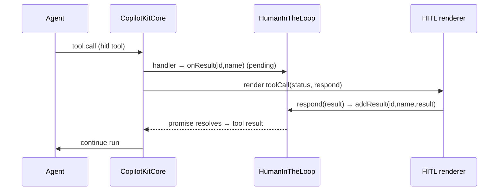

# angular - HumanInTheLoop

A tiny `@Injectable({ providedIn: "root" })` RxJS bridge that lets a human-in-the-loop tool's async handler **await** a UI-supplied response. Part of [[@copilotkitnext/angular]]; the frontend implementation of [[Multi-Agent]] HITL flows on top of [[Tools (Frontend & Backend)]].

```ts
@Injectable({ providedIn: "root" })
export class HumanInTheLoop {
  results = new Subject<{ toolCallId: string; toolName: string; result: unknown }>();
  addResult(toolCallId: string, toolName: string, result: unknown): void;       // next()
  onResult(toolCallId: string, toolName: string): Promise<unknown>;             // filtered first value
}
```

## How it works

- When `addHumanInTheLoop` registers a HITL tool, the [[angular - CopilotKit service]] binds the tool's `handler` to `hitl.onResult(toolCall.id, name)`. So when the agent invokes the tool, the handler returns a **pending promise** that only resolves once the UI responds.
- `onResult` subscribes to the `results` Subject, `filter`s for the matching `toolCallId` + `toolName`, takes the first, and wraps it with `lastValueFrom` → `Promise`.
- The renderer component (a `HumanInTheLoopToolRenderer`, see [[angular - Tools & ToolRenderer]]) receives a `respond(result)` callback in its `toolCall` signal. Calling it routes to `HumanInTheLoop.addResult(...)` inside [[angular - render-tool-calls]] (`buildHumanInTheLoopToolCall`), emitting on the Subject and resolving the awaiting handler.


