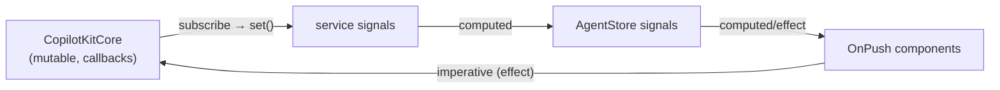

# angular - Signal architecture (note)

How [[@copilotkitnext/angular]] reconciles Angular's reactivity (signals + a little RxJS) with [[core - CopilotKitCore]]'s framework-agnostic, subscriber/callback-based state. This is the package's defining design choice: **the core is the source of truth; signals are a synchronized projection of it.**

## The bridge: subscriber callbacks → `signal.set()`

`CopilotKitCore` exposes mutable state (agents, runtime connection status, headers, runtime URL/transport) and a `subscribe(...)` API that fires callbacks on change. The [[angular - CopilotKit service]] holds private `WritableSignal`s for each piece of that state, exposes them as readonly signals, and in its constructor subscribes to core — each callback simply `.set()`s the matching signal:

```
onAgentsChanged                  → #agents.set(core.agents)
onRuntimeConnectionStatusChanged → #runtimeConnectionStatus.set(status)
onHeadersChanged                 → #headers.set(headers)
```

The three tool-render registries (`toolCallRenderConfigs`, `clientToolCallRenderConfigs`, `humanInTheLoopToolRenderConfigs`) are likewise `WritableSignal<…[]>` mutated through `update()` in the `add*`/`removeTool` methods. Consumers (e.g. [[angular - render-tool-calls]]) read them as signals so the UI recomputes when tools change.

## Per-agent state via `computed`

[[angular - AgentStore & CopilotkitAgentFactory]] composes the service's signals: `createAgentStoreSignal` returns a `computed()` that reads `agents()`, `runtimeConnectionStatus()`, `runtimeUrl()`, `runtimeTransport()`, `headers()`. Any change re-runs the computed, which tears down the old `AgentStore` and builds a fresh one bound to the resolved `AbstractAgent`. Inside `AgentStore`, `core.subscribeToAgentWithOptions` callbacks set `messages`/`state`/`isRunning` signals — the same callback→signal pattern, one level down at the agent granularity.

## Effects for side effects, not state

`CopilotChat` ([[angular - Chat components]]) uses `effect(...)` (with `allowSignalWrites: true` where it writes signals) to react to the agent becoming available: set `threadId`, connect once, and toggle the typing cursor while running. Effects here drive imperative side effects (connect/run, `cdr.markForCheck()`), while derived view data stays in `computed`.

## Where RxJS still lives

Signals do not cover everything. RxJS remains for:
- **Event streams over time** — `ScrollPosition` / `ResizeObserverService` and the `StickToBottom` directive ([[angular - Directives (agent-context/stick-to-bottom/tooltip)]]).
- **Async request/response** — [[angular - HumanInTheLoop]] uses a `Subject` + `lastValueFrom` to turn a future UI response into an awaitable promise for a tool handler.

## Why this shape



The pattern keeps the cross-framework `@copilotkit/core` ignorant of Angular while giving Angular consumers idiomatic, `OnPush`-friendly, glitch-free reactive reads. The trade-off is the explicit hand-written sync layer in the [[angular - CopilotKit service]] (and the `unsubscribe()`/`teardown()` bookkeeping in `AgentStore`). Contrast with React (`@copilotkit/react-core`) and Vue (`@copilotkit/vue`), which wrap the same core with their own reactivity primitives. See also [[@copilotkit vs @copilotkitnext]] for why this package is independently versioned.
