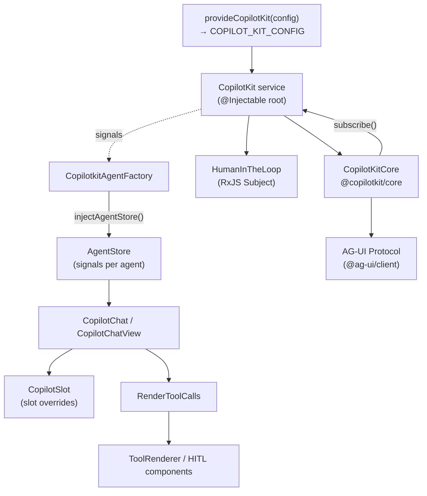

# @copilotkitnext/angular

Angular binding for CopilotKit. It wraps the framework-agnostic [[core - CopilotKitCore]] in an Angular-idiomatic surface: a root DI service, signal-based reactive state, standalone components, directives, and a slot-override system. It speaks the [[AG-UI Protocol]] through `@copilotkit/core` and the `@ag-ui/client` runtime.

## Scope & version (correction)

Unlike the rest of the monorepo, this package publishes as **`@copilotkitnext/angular`** at **v1.54.3** on its own independent release track (tagged `angular/v*`, not the monorepo's `v*`). This is the **only** local package using the `@copilotkitnext` scope — the other `@copilotkitnext/*` packages (`react`, `agent`, `runtime`) are externally-published and are **not** built from this repo. See [[@copilotkit vs @copilotkitnext]].

- `license: "Commercial"`. Ships a license watermark when no valid CopilotCloud key is present (see [[angular - CopilotKitConfig (DI)]]).
- `type: "module"`, Angular **19** (`@angular/core` `^19`, `@angular/cdk` `^19`), TypeScript 5.8, RxJS 7.

## Entry points / exports

- `package.json#exports`: `.` → `dist/fesm2022/copilotkitnext-angular.mjs` (FESM2022), and `./styles.css` → compiled Tailwind.
- `types` → `dist/index.d.ts`. The ng-packagr `entryFile` is `src/index.ts`, which re-exports `src/public-api.ts`.
- `public-api.ts` re-exports every `lib/*` module: config, the `CopilotKit` service, tools, render-tool-calls, agent store, chat-config, chat-state, scroll/resize services, utils, agent-context, slots, the three directives, and all chat components.

## Subsystems

- [[angular - CopilotKit service]] — the root `@Injectable` orchestrator wrapping `CopilotKitCore`.
- [[angular - CopilotKitConfig (DI)]] — `CopilotKitConfig`, `COPILOT_KIT_CONFIG` token, `provideCopilotKit()`, license resolution.
- [[angular - AgentStore & CopilotkitAgentFactory]] — per-agent reactive state via `injectAgentStore`.
- [[angular - Tools & ToolRenderer]] — tool config types, renderer interfaces, `register*` injectors.
- [[angular - HumanInTheLoop]] — RxJS `Subject`-based bridge for HITL tool responses.
- [[angular - render-tool-calls]] — the `RenderToolCalls` component that resolves and renders tool-call UIs.
- [[angular - Chat components]] — `CopilotChat`, `CopilotChatView`, and the full standalone-component chat tree.
- [[angular - Directives (agent-context/stick-to-bottom/tooltip)]] — `copilotkitAgentContext`, `copilotStickToBottom`, `copilotTooltip`.
- [[angular - Slots]] — the slot/override engine (`copilot-slot`, `renderSlot`, `provideSlots`).
- [[angular - Signal architecture (note)]] — how Angular signals + RxJS reconcile against `CopilotKitCore`'s subscriber model.

## Key symbols

`CopilotKit` · `provideCopilotKit` · `CopilotKitConfig` · `COPILOT_KIT_CONFIG` · `injectAgentStore` · `AgentStore` · `CopilotkitAgentFactory` · `registerFrontendTool` · `registerHumanInTheLoop` · `registerRenderToolCall` · `connectAgentContext` · `CopilotChat` · `CopilotChatView` · `ChatState` · `provideCopilotChatLabels` · `CopilotSlot` · `renderSlot`.

## Depends on / depended on by

- **Depends on:** [[@copilotkit/core]] (`CopilotKitCore`, `ProxiedCopilotRuntimeAgent`, tool/transport types), [[@copilotkit/shared]] (`DEFAULT_AGENT_ID`, `randomUUID`, `partialJSONParse`, `StandardSchemaV1`), and the external `@ag-ui/client` / `@ag-ui/core` (`AbstractAgent`, `Message`, `ToolCall`, `Context`). Implements [[Tools (Frontend & Backend)]], [[Context]], [[Multi-Agent]], [[A2UI (Generative UI)]] rendering, and uses [[ProxiedAgent]] for runtime-backed agents.
- **Depended on by:** Angular host applications (not by other monorepo packages).

## Build / test

- **Build:** `ng-packagr -p ng-package.json` (FESM2022) + Tailwind CSS v4 CLI compiling `src/styles/globals.css` → `dist/styles.css`, post-processed by `scripts/scope-preflight.mjs`. No tsdown/vite bundling here (ng-packagr is Angular-specific). Verified with `publint` + `attw` (node16 profile).
- **Test:** **vitest** via `@analogjs/vitest-angular` + `@analogjs/vite-plugin-angular`, jsdom environment, `zone.js` and `reflect-metadata` in `test-setup.ts`. Specs live beside source and under `components/chat/__tests__` and `directives/__tests__`.

## Internal structure

