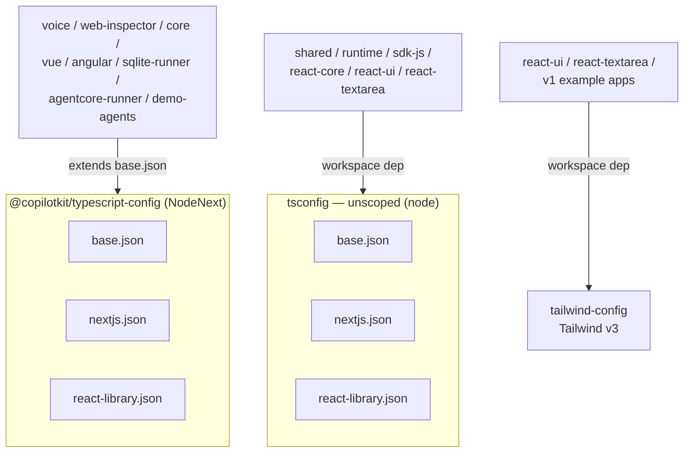

# Config Packages MOC

Map of the shared **build-configuration packages** under `packages/`. These are not shipped runtime code — they are workspace-internal presets that other packages and example apps `extends`/depend on so TypeScript and Tailwind settings stay consistent across the monorepo.

## Notes in this folder

- [[typescript-config]] — `@copilotkit/typescript-config` (v1.55.0-next.8). The **modern** TS preset set (`base.json`, `nextjs.json`, `react-library.json`) on `NodeNext` resolution. Consumed by the newer flat-structure packages.
- [[tsconfig (legacy presets)]] — unscoped `tsconfig` (v1.4.12). The **legacy** TS preset set (same three filenames) on `node` resolution. Still consumed by older packages and v1 example apps.
- [[tailwind-config]] — unscoped `tailwind-config` (v1.4.12). Shared Tailwind **v3** config exposing `brandblue`/`brandred` theme colors.

## The two-tsconfig situation

> [!important] Two TypeScript-config packages coexist
> `@copilotkit/typescript-config` and the unscoped `tsconfig` both ship the same three preset filenames (`base.json`, `nextjs.json`, `react-library.json`) but with **different compiler settings** (NodeNext vs node module resolution, differing `lib`/`target`/strictness). They are used side-by-side by different packages. This is apparent redundancy from the V1→flat consolidation; this KB does **not** assert which is canonical — see each note for exactly who consumes it (verified from `tsconfig.json`/`package.json` across the repo).

These packages are part of the broader [[Build-CI-Release MOC]] toolchain (Nx, pnpm, tsdown, vitest).
