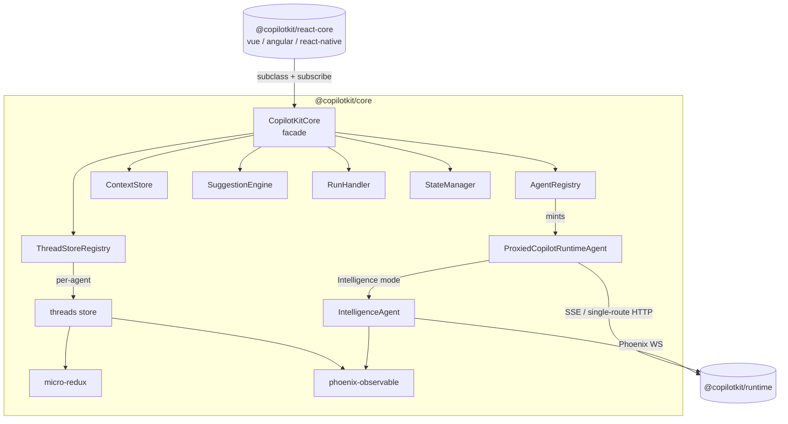

# @copilotkit/core

Framework-agnostic frontend orchestrator for CopilotKit. This is the brain that every framework binding ([[@copilotkit/react-core]], [[@copilotkitnext/angular]], [[@copilotkit/vue]], [[@copilotkit/react-native]]) wraps and subclasses. It owns the agent registry, tool registry, context store, suggestions, run handling, per-run state tracking, and thread stores — all delegated to focused subsystem classes — and exposes a subscriber-based event surface that the framework layers translate into reactive state.

- **Published as** `@copilotkit/core` at **v1.57.4** (`@copilotkit/` scope, public).
- **Module format:** ESM-first (`type: module`); ships `dist/index.mjs` (import), `dist/index.cjs` (require), `index.umd.js` (unpkg/jsdelivr), `.d.cts` types. Built with **tsdown**.
- **Runtime deps:** `@ag-ui/client` (0.0.53 — provides `AbstractAgent`, `HttpAgent`, `Context`, `State`, event types), [[@copilotkit/shared]], `@tanstack/pacer` (throttling), `phoenix` (websocket client for Intelligence), `rxjs` (7.8.1), `zod-to-json-schema`.

## Entry points / exports

Single entry (`.`). `src/index.ts` re-exports:
- `./core` — [[core - CopilotKitCore]] + its config/subscriber/param types and the `core/index.ts` subsystem barrel ([[core - AgentRegistry]], [[core - ContextStore]], [[core - SuggestionEngine]], [[core - RunHandler]], [[core - StateManager]]).
- `./types` — [[core - FrontendTool types]], [[core - Suggestion types]], `ToolCallStatus`, `CopilotRuntimeTransport`.
- `./agent` — [[core - ProxiedCopilotRuntimeAgent]].
- `./intelligence-agent` — [[core - IntelligenceAgent]] + `AgentThreadLockedError`.
- `./threads` — [[core - threads]] (the `ɵ`-prefixed thread store API).
- `./utils/micro-redux` — [[core - micro-redux]].
- `./utils/phoenix-observable` — [[core - phoenix-observable]].
- `./utils/markdown` — `completePartialMarkdown(input)`, a streaming-safe markdown auto-closer (closes dangling code fences, links, emphasis); small utility, no dedicated note.

> Note: [[core - ThreadStoreRegistry]] lives in `src/core/thread-store-registry.ts` and is wired into `CopilotKitCore` directly; it is not re-exported through `core/index.ts`.

## Subsystems

`CopilotKitCore` is a thin facade. In its constructor it instantiates seven delegates, passing `this`, and forwards public methods to them:

- [[core - AgentRegistry]] — local + runtime agent registration, `/info` fetch, transport detection.
- [[core - ContextStore]] — additional context entries injected into every run.
- [[core - SuggestionEngine]] — static + AI-generated next-message suggestions.
- [[core - RunHandler]] — agent runs, tool registry, tool execution + follow-ups.
- [[core - StateManager]] — per-run state snapshots and message→run association.
- [[core - ThreadStoreRegistry]] — per-agent [[core - threads]] stores.

## Key symbols

- [[core - CopilotKitCore]] — the orchestrator class + `CopilotKitCoreConfig`, `CopilotKitCoreSubscriber`, `CopilotKitCoreErrorCode`, `SubscribeToAgentSubscriber`.
- [[core - ProxiedCopilotRuntimeAgent]] — the `AbstractAgent` that talks to a [[@copilotkit/runtime]] over SSE or Intelligence websockets.
- [[core - IntelligenceAgent]] — Phoenix-websocket agent for the [[Intelligence Platform vs SSE]] runtime mode.
- [[core - FrontendTool types]] · [[core - Suggestion types]] — the public type surface.
- [[core - micro-redux]] · [[core - phoenix-observable]] — internal building blocks powering [[core - threads]] and [[core - IntelligenceAgent]].

## Depends on / depended on by

- **Depends on:** [[@copilotkit/shared]] (`randomUUID`, `logger`, `resolveDebugConfig`, `schemaToJsonSchema`, runtime-mode constants, `phoenixExponentialBackoff`, shared types), `@ag-ui/client` (external).
- **Depended on by:** [[@copilotkit/react-core]] (subclasses `CopilotKitCore` as `CopilotKitCoreReact`), [[@copilotkit/vue]] (`CopilotKitCoreVue`), [[@copilotkitnext/angular]], [[@copilotkit/react-native]].

## Concepts implemented

[[Three-Layer Architecture]] (this is the entire frontend layer's engine) · [[AG-UI Protocol]] (consumes `@ag-ui/client` agents + events) · [[ProxiedAgent]] · [[Tools (Frontend & Backend)]] · [[Context]] · [[Suggestions]] · [[Threads]] · [[Multi-Agent]] · [[Intelligence Platform vs SSE]] · [[DebugConfig]] · [[Telemetry & Licensing]].

## Build / test

- **Bundler:** tsdown (`pnpm build`). **Types:** `tsc --noEmit`.
- **Tests:** vitest (`pnpm test`). Extensive suite under `src/__tests__/` and `src/core/__tests__/` (run-handler schema/zod, state-manager, thread-store-registry, suggestions e2e, micro-redux, phoenix-observable, intelligence-agent, thread-switch races, etc.).

