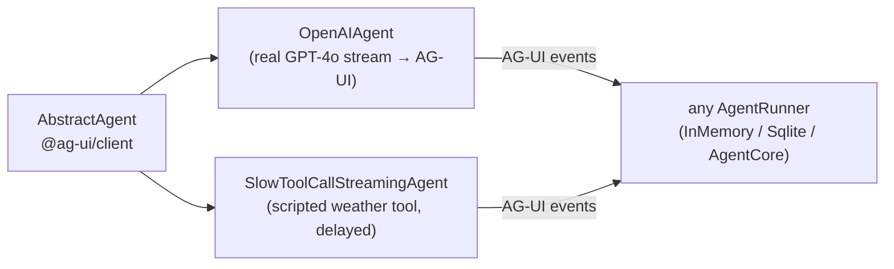

# @copilotkit/demo-agents

A small collection of **reference / demo [[AG-UI Protocol]] agents** used to exercise the runtime and frontend without a full LLM-graph setup. Each agent extends `AbstractAgent` from `@ag-ui/client` and emits a hand-rolled stream of AG-UI events through an RxJS `Observable`.

**Private, unpublished** (`"private": true`) and on the independent **v1.55.0-next.8** version line (not the v1.57.4 monorepo version) — this is an internal fixtures/demo package, consumed only inside the repo (e.g. by showcase/examples and tests). ESM-first, single export (`.`). Built with **tsdown**, tested with **vitest**.

## Exports

`src/index.ts` exports two classes:
- `OpenAIAgent` (from `./openai.js`) → [[demo-agents - OpenAIAgent]]
- `SlowToolCallStreamingAgent` (from `./slow-tool-call-streaming.js`) → [[demo-agents - SlowToolCallStreamingAgent]]

## Dependencies

- `@ag-ui/client` (`0.0.53`) — `AbstractAgent`, `RunAgentInput`, `EventType`, `BaseEvent`, `ToolCallResultEvent`.
- `openai` (`^4.85.1`) — used only by `OpenAIAgent`.
- `rxjs` (`^7.8.1`) — `Observable`.

## How they fit

Because they implement the `AbstractAgent.run(input)` contract, either can be handed to any [[AgentRunner]] — [[runtime - InMemoryAgentRunner]], [[@copilotkit/sqlite-runner]], or [[@copilotkit/agentcore-runner]] — to drive a thread end-to-end.

## Subsystems / symbols

- [[demo-agents - OpenAIAgent]] — streams a real OpenAI `gpt-4o` chat completion, mapping deltas to AG-UI text/tool-call chunks.
- [[demo-agents - SlowToolCallStreamingAgent]] — a fully scripted, artificially-delayed agent (no LLM) that emits a fixed weather tool call + result; useful for testing streaming UX, cancellation, and tool rendering.
