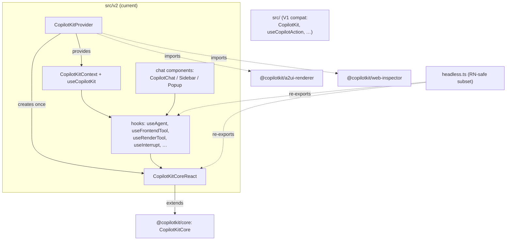

# @copilotkit/react-core

The **React binding** for CopilotKit. Published as `@copilotkit/react-core` at **v1.57.4** (MIT, public). It wraps the framework-agnostic [[@copilotkit/core]] orchestrator in a React provider plus a suite of hooks and components, and re-exports `@ag-ui/client` types so consumers get the [[AG-UI Protocol]] surface in one import.

This package is **dual-architecture internally**:

- **V2 (current)** lives in `src/v2/` and is the modern surface — the [[react-core - CopilotKitProvider]], a `CopilotKitCore` subclass ([[react-core - CopilotKitCoreReact]]), V2 hooks, and the V2 chat components.
- **V1 (legacy)** lives in `src/` and is re-exported for backward compatibility (`CopilotKit`, `CopilotKitProps` from `src/components/copilot-provider/`). See [[react-core - V1 hooks (useCopilotAction/useCoAgent/…)]] and [[react-core - V1 contexts]].
- **`src/v2/headless.ts`** is the **React-Native-safe subset** — no CSS, no DOM, no web UI — consumed by [[@copilotkit/react-native]]. See [[react-core - headless export (RN)]].

## Entry points / exports

From `package.json` `exports`:

| Subpath | Purpose |
| --- | --- |
| `.` | Default entry. Built from `src/index.tsx`; re-exports the V1 surface and (via `src/v2/index.ts` content merged through the build) the public API. |
| `./v2` | Modern V2 surface — `export *` of core, `@ag-ui/client`, components, hooks, providers, types, plus A2UI helpers and the V1 compat `CopilotKit`. |
| `./v2/context` | Standalone build of `src/v2/context.ts` (`CopilotKitCoreReact`, `CopilotKitContext`). Built separately so RN and web share **one** React context instance / class declaration. |
| `./v2/headless` | Platform-agnostic hooks + `CopilotKitCoreReact`, no UI. RN consumes this. |
| `./v2/styles.css` | Compiled Tailwind stylesheet (`dist/v2/index.css`). |

`main`/`module`/`types` point at `dist/index.{cjs,mjs,d.mts}`. `"use client"` is stamped on the V2 entry and provider/context/hook files for RSC compatibility.

## Subsystems

- **Provider & context** — [[react-core - CopilotKitProvider]], [[react-core - CopilotKitCoreReact]], the `CopilotKitContext` / `useCopilotKit` accessor, and the `CopilotChatConfigurationProvider`.
- **V2 hooks** — [[react-core - useAgent]], [[react-core - useFrontendTool]], [[react-core - useAgentContext]], [[react-core - useHumanInTheLoop]], [[react-core - useInterrupt]], [[react-core - useSuggestions]], [[react-core - useThreads]], [[react-core - useRenderTool]], [[react-core - useComponent]], [[react-core - useCapabilities]], [[react-core - useAttachments]].
- **V2 chat components** — [[react-core - CopilotChat (v2)]], [[react-core - Chat Subcomponents (v2)]], [[react-core - CopilotSidebar/Popup (v2)]].
- **Generative-UI renderers** — [[react-core - A2UI renderers]], [[react-core - OpenGenerativeUI/MCP renderers]].
- **V1 compat layer** — [[react-core - V1 hooks (useCopilotAction/useCoAgent/…)]], [[react-core - V1 contexts]], [[react-core - useCopilotChat (v1)]], [[react-core - useCopilotReadable (v1)]], [[react-core - useLangGraphInterrupt (v1)]].
- **Headless / RN** — [[react-core - headless export (RN)]].

## Key symbols

- [[react-core - CopilotKitProvider]] — the root provider component.
- [[react-core - CopilotKitCoreReact]] — `CopilotKitCore` subclass adding React renderer registries.
- [[react-core - useAgent]] — the central hook returning an [[AG-UI Protocol]] `AbstractAgent`.
- [[react-core - useFrontendTool]] · [[react-core - useComponent]] · [[react-core - useRenderTool]] — register [[Tools (Frontend & Backend)]] and renderers.
- [[react-core - useHumanInTheLoop]] · [[react-core - useInterrupt]] — human-in-the-loop and agent interrupts.
- [[react-core - useAgentContext]] — feed [[Context]] to the agent.
- [[react-core - useSuggestions]] · [[react-core - useThreads]] · [[react-core - useCapabilities]] · [[react-core - useAttachments]] — [[Suggestions]], [[Threads]], capability introspection, and file attachments.

## Depends on / depended on by

**Depends on:** [[@copilotkit/core]] (re-exported wholesale), [[@copilotkit/shared]], [[@copilotkit/runtime-client-gql]], [[@copilotkit/a2ui-renderer]] (A2UI rendering), [[@copilotkit/web-inspector]] (dev console). External: `@ag-ui/client`, `@ag-ui/core`, `@jetbrains/websandbox` (OpenGenerativeUI sandbox), `@radix-ui/*`, `react-markdown`/`streamdown`/`katex` (markdown), `@tanstack/react-virtual`, `use-stick-to-bottom`, `rxjs`, `zod-to-json-schema`.

**Depended on by:** [[@copilotkit/react-ui]], [[@copilotkit/react-textarea]], [[@copilotkit/react-native]] (via `./v2/headless`).

> Note: the externally-published `@copilotkitnext/react` (consumed by `showcase/shell` via the `next` dist-tag) is a *separate* legacy publish scope and is **not** built from this package — see [[@copilotkit vs @copilotkitnext]].

## Build / test

- **Bundler:** `tsdown` (three entry sets: main + v2, standalone `v2/context`, and `v2/headless`), with `@copilotkit/*` + `react`/`react-dom`/`rxjs`/css marked **external** so RN reuses the same class declarations.
- **CSS:** Tailwind CLI compiles `src/v2/styles/globals.css` → `dist/v2/index.css` via a `build:css` step plus a scope-preflight script.
- **Tests:** `vitest` (jsdom), `@testing-library/react`. Extensive `.test.tsx` / `.e2e.test.tsx` coverage across hooks, providers, and chat components.
- **Peers:** React 18 or 19, `zod >=3`.

## Internal structure

Implements the [[Three-Layer Architecture]] frontend layer and the React-side of [[Tools (Frontend & Backend)]], [[Context]], [[Suggestions]], [[Threads]], [[A2UI (Generative UI)]], and [[Debug Mode]].
