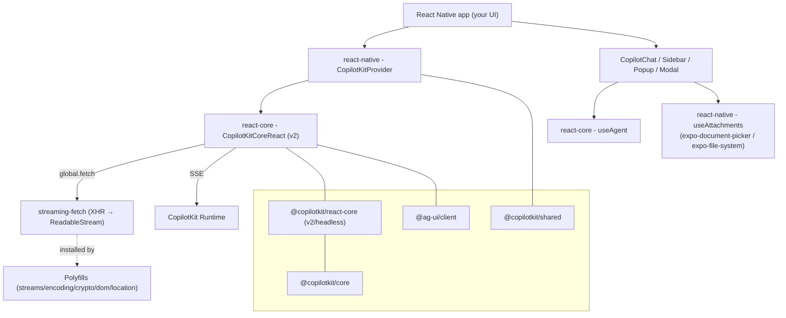

# @copilotkit/react-native

**Headless** React Native bindings for CopilotKit. Published as `@copilotkit/react-native` at **v1.57.4** (public, MIT). It ships a lightweight provider, a small set of headless chat components, a native attachments hook, and a bundle of Web-API **polyfills** — then re-exports the platform-agnostic hooks from [[@copilotkit/react-core]]'s RN-safe subset. There is **no DOM, CSS, or web-framework dependency**; consumers build their own UI with standard React Native views.

> This note is the **MOC** for `02-Packages/react-native/` — it links every note in the folder.

## Root import IS the v2 API

Unlike the web SDK (which exposes its modern API under a `/v2` subpath), React Native exports the **v2 API directly from the package root**. The root import wraps [[react-core - CopilotKitCoreReact]] and re-exports hooks from `@copilotkit/react-core/v2/headless` and context from `@copilotkit/react-core/v2/context`. See [[@copilotkit vs @copilotkitnext]] for the broader naming/versioning landscape.

## Entry points / exports

From `package.json` `exports` (built by [[react-native - Polyfills]]'s tsdown config to `dist/*.{mjs,cjs}` with `.d.cts` types):

| Subpath | Purpose |
| --- | --- |
| `.` | Main entry. **Side-effecting**: importing it auto-installs all polyfills (`import "./polyfills"` runs first), then exports provider, components, hooks, and re-exported types. |
| `./polyfills` | All polyfills + `installStreamingFetch()` in one import. |
| `./polyfills/streams` | `ReadableStream` / `WritableStream` / `TransformStream`. |
| `./polyfills/encoding` | `TextEncoder` / `TextDecoder`. |
| `./polyfills/crypto` | `crypto.getRandomValues`. |
| `./polyfills/dom` | `DOMException` / `Headers`. |
| `./polyfills/location` | `window.location`. |
| `./package.json` | Raw manifest. |

`sideEffects` is restricted to `dist/index.*`, `dist/polyfills.*`, and `dist/polyfills/**` so bundlers can tree-shake the components but still run the polyfill installers.

## Subsystems

- [[react-native - Polyfills]] — the Web-API shims (streams, encoding, crypto, DOMException/Headers, location) that make CopilotKit run under Hermes; auto-installed via the root import.
- [[react-native - streaming-fetch]] — XHR-based `global.fetch` replacement that gives RN a `ReadableStream` response body for SSE, with a critical JS-thread-deferral fix for iOS.
- [[react-native - headless re-exports]] — the curated set of hooks/types re-exported from [[@copilotkit/react-core]], [[@copilotkit/core]], and `@ag-ui/client`.

## Key symbols

- [[react-native - CopilotKitProvider]] — the RN provider (`CopilotKitNativeProviderProps`), a web-dependency-free alternative to the web provider.
- [[react-native - CopilotChat/Sidebar/Popup/Modal]] — the four component surfaces: a headless `CopilotChat` (+ `useCopilotChatContext`), a pass-through `CopilotModal`, and two pre-built UI components `CopilotSidebar` (slide-in drawer) and `CopilotPopup` (FAB + bottom-sheet).
- [[react-native - useAttachments]] — Expo-backed file-attachment hook (`expo-document-picker` + `expo-file-system`), the RN counterpart of [[react-core - useAttachments]].

## Depends on

- [[@copilotkit/core]] — `workspace:*`. Source of `CopilotKitCoreErrorCode`, `Suggestion`, `FrontendTool`, `ToolCallStatus`, connection-status types (re-exported).
- [[@copilotkit/react-core]] — `workspace:*`. Consumes the **RN-safe** `v2/headless` + `v2/context` subpaths only (see [[react-core - headless export (RN)]]). Provides [[react-core - CopilotKitCoreReact]], [[react-core - useAgent]], `useFrontendTool`, `useHumanInTheLoop`, `useInterrupt`, `useSuggestions`, `useThreads`, `useRenderTool`, etc.
- [[@copilotkit/shared]] — `workspace:*`. `DebugConfig`, `randomUUID`, `DEFAULT_AGENT_ID`, `InputContent`, attachment types + helpers (`getModalityFromMimeType`, `formatFileSize`) — see [[shared - Attachments]] and [[DebugConfig]].
- `@ag-ui/client` `0.0.53` — `Message`, `AssistantMessage`, `ToolCall`, `ToolMessage`, `AbstractAgent`, `AgentCapabilities` (re-exported for parity with the web SDK). Implements the [[AG-UI Protocol]].
- `text-encoding` `^0.7.0`, `web-streams-polyfill` `^4.2.0` — polyfill backings.

**Optional peer deps:** `expo-document-picker` (≥12), `expo-file-system` (≥17), `zod` (≥3) are all optional; required peers are `react` (^18 || ^19) and `react-native` (≥0.70).

## Depended on by

Nothing else in this repo depends on `@copilotkit/react-native` — it is a leaf consumer package for mobile apps.

## What it does NOT include

The index deliberately **omits** web-coupled react-core exports: `useRenderToolCall`, `useRenderCustomMessages`, `useRenderActivityMessage`, and `useDefaultRenderTool` — these depend on the web `DefaultToolCallRenderer` (which emits `
`/`<svg>`) or are tied to the web chat rendering pipeline. Cloud features (`publicApiKey`, `licenseToken`) are also **not yet supported**; the provider hard-codes a permissive [[react-native - CopilotKitProvider|license context]] (`checkFeature → true`).

## Build / test

- **Bundler:** tsdown (esm + cjs, `dts: true`, `target: es2022`). `react`, `react-native`, `@ag-ui/client`, and the three `@copilotkit/*` deps are marked `external`.
- **Tests:** vitest in a `jsdom` environment. `react-native` is excluded from bundling (Flow syntax) and Expo modules are aliased to local stubs under `src/__tests__/__mocks__/`.

