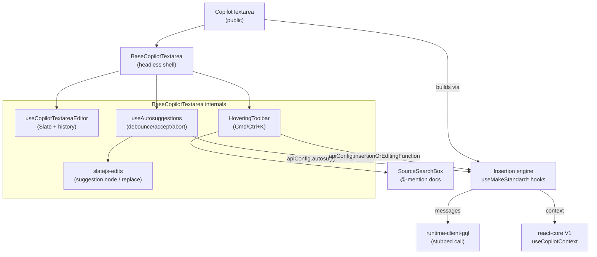

# @copilotkit/react-textarea

An AI-augmented drop-in replacement for the HTML `<textarea>`. It renders a [Slate](https://docs.slatejs.org/) rich-text editor that surfaces **inline AI autocompletions** as the user types, plus a **hovering editor** (default `Cmd/Ctrl + K`) that inserts or rewrites the selected text from a natural-language prompt. This is a **V1-layer** package: it talks to the legacy [[@copilotkit/react-core]] V1 context (`useCopilotContext`) and constructs GraphQL messages via [[@copilotkit/runtime-client-gql]].

- **Published name:** `@copilotkit/react-textarea`
- **Version:** `1.57.4` (public, `@copilotkit/` scope — see [[@copilotkit vs @copilotkitnext]])
- **Module type:** ESM-first (`"type": "module"`), ships CJS + ESM + UMD (see Build / test below).

## Entry points / exports

`package.json` `exports`:
- `.` → `dist/index.mjs` (import) / `dist/index.cjs` (require)
- `./styles.css` → `dist/index.css` (the stylesheet must be imported separately)
- `./package.json`

`src/index.tsx` is `"use client"`, imports `./styles.css` for side effects, and re-exports from `./components`, `./context`, `./hooks`, `./types`. **Note:** `src/context/index.ts` and `src/hooks/index.ts` are empty barrels — the public surface is effectively the components and types. The primary public symbols are `CopilotTextarea`, `BaseCopilotTextarea`, `CopilotTextareaProps`, and the autosuggestions config types.

## Subsystems & symbols

- [[react-textarea - CopilotTextarea]] — the public component; wires the standard runtime-backed suggestion/insertion functions onto the base.
- [[react-textarea - BaseCopilotTextarea]] — the headless UX shell (bring-your-own backend functions).
- [[react-textarea - Slate editor (useCopilotTextareaEditor)]] — the custom Slate editor with the `suggestion` void inline node.
- [[react-textarea - useAutosuggestions]] — the inline-completion state machine (debounce, accept, abort).
- [[react-textarea - Autosuggestions config types]] — `BaseAutosuggestionsConfig`, `AutosuggestionsConfig`, the per-mode API configs and defaults.
- [[react-textarea - Insertion engine]] — the `useMakeStandard*` hooks that build messages for suggest / insert / edit modes.
- [[react-textarea - HoveringToolbar]] — the floating `Cmd/Ctrl+K` editor (provider, positioning, prompt box).
- [[react-textarea - SourceSearchBox]] — the `@`-mention document picker inside the hovering editor.
- [[react-textarea - slatejs-edits]] — low-level Slate transforms (insert/clear suggestion, replace text, partial undo history) and the editor↔text helpers.

## Depends on

- [[@copilotkit/react-core]] — V1 context: `useCopilotContext`, `DocumentPointer`, `defaultCopilotContextCategories`.
- [[@copilotkit/runtime-client-gql]] — `TextMessage`, `Role`, `CopilotRequestType`, `convertGqlOutputToMessages`, `convertMessagesToGqlInput`, `filterAgentStateMessages`.
- [[@copilotkit/shared]] — `COPILOT_CLOUD_PUBLIC_API_KEY_HEADER`, `isMacOS`.
- Third-party: `slate` / `slate-react` / `slate-history` (editor), `@mui/material` (chips), `cmdk` + `@radix-ui/*` (command palette UI), `lucide-react`, `material-icons`, `@emotion/*`, `tailwind-merge` + `clsx`, `lodash.merge`.

Peer deps: React 18 or 19. There are **no** packages in this repo that depend on `react-textarea`; it is a standalone consumer-facing component.

> [!warning] V1 runtime wiring is currently stubbed
> In [[react-textarea - Insertion engine]] (`use-make-standard-autosuggestions-function.tsx` and `use-make-standard-insertion-function.tsx`) the actual `runtimeClient.generateCopilotResponse(...)` calls are **commented out** and replaced with no-op stubs (`const runtimeClient = { generateCopilotResponse: () => {} }`, `const response: any = {}`). The hooks still assemble the system prompt, few-shot messages, and user messages, but no network request is made — so the standard `CopilotTextarea` produces empty completions in this revision of the source. The UX, Slate editing, debouncing, accept/abort, and hovering-editor flows are all live; only the model call is disabled. State this as-is to consumers.

## Build / test

- **Bundler:** [tsdown](https://github.com/sxzz/tsdown) (`tsdown.config.ts`) emits ESM + CJS (with `.d.ts`) and a separate UMD build (`globalName: "CopilotKitReactTextarea"`). `react`/`react-dom` are always external; the UMD build also externalizes the `@copilotkit/*` deps and Slate. CSS is emitted to `dist/index.css` and re-mapped to the `./styles.css` export.
- **Tests:** vitest (`vitest.config.mjs`); `src/esm-compat.test.ts` and `src/lib/utils.test.ts`.
- **Types:** `tsc --noEmit` (`check-types`); publint + are-the-types-wrong (`attw`) for package-export correctness.

## Architecture

Related concepts: [[Tools (Frontend & Backend)]], [[Context]], [[@copilotkit vs @copilotkitnext]].
