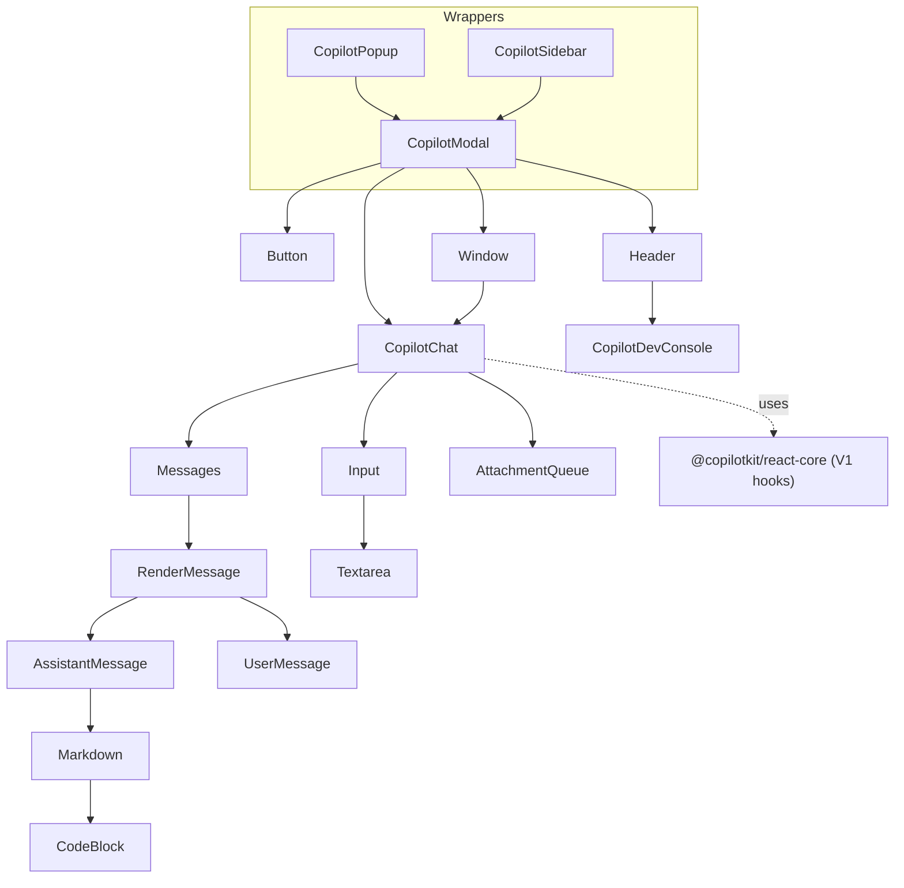

# @copilotkit/react-ui

Pre-built React chat UI for CopilotKit: drop-in `CopilotChat`, `CopilotPopup`, and `CopilotSidebar` components plus the developer console, markdown rendering, attachment previews, and a small set of UI hooks. Published as `@copilotkit/react-ui` at **v1.57.4** (MIT). This package is **V1-only UI** — every component is built on the legacy V1 hook layer of [[@copilotkit/react-core]] (the modern V2 chat components, e.g. [[react-core - CopilotChat (v2)]], live in react-core, not here). The `./v2/styles.css` export is only a CSS shim; there is no V2 component code in this package.

## Entry points / exports

From `package.json`:
- **`.`** → `dist/index.mjs` / `dist/index.cjs` (ESM + CJS, `"use client"`). Bundles `components`, `context` (empty), `hooks`, and `types`.
- **`./styles.css`** → `dist/index.css` — the default V1 stylesheet (imported as a side effect from `src/styles.css`).
- **`./v2/styles.css`** → `dist/v2/index.css` — copied verbatim from `src/v2/styles.css` (which only re-imports the same `styles.css`) by the `build:css` script.

The package is `"type": "module"`, marks `**/*.css` as side-effectful, and ships `unpkg`/`jsdelivr` UMD builds.

## Subsystems

- [[react-ui - CopilotChat]] — the headless-styled chat panel (the core component all others wrap).
- [[react-ui - CopilotPopup]] — floating popup wrapper around `CopilotModal`.
- [[react-ui - CopilotSidebar]] — collapsible sidebar wrapper around `CopilotModal`.
- [[react-ui - CopilotModal]] — `Button` + `Window` + `Header` shell that hosts `CopilotChat`; base for popup/sidebar.
- [[react-ui - Messages]] — message list, scroll-to-bottom, render dispatch, message subcomponents.
- [[react-ui - Input & Textarea]] — chat input, auto-resizing textarea, send/stop/upload/push-to-talk controls.
- [[react-ui - Suggestions]] — suggestion pills + `useCopilotChatSuggestions` hook.
- [[react-ui - Markdown & CodeBlock]] — react-markdown renderer with syntax-highlighted code blocks.
- [[react-ui - Attachments]] — attachment queue, attachment/image renderers, and the V1→V2 deprecation bridge.
- [[react-ui - dev-console]] — the floating developer console (version check, debug menu, help modal).
- [[react-ui - hooks (useDarkMode/usePushToTalk)]] — UI hooks (dark mode, push-to-talk, copy-to-clipboard).

## Key exported symbols

`CopilotChat`, `CopilotPopup`, `CopilotSidebar`, `CopilotModal` (+ `CopilotModalProps`), `Markdown`, `AssistantMessage`, `UserMessage`, `ImageRenderer`, `useChatContext`, `RenderSuggestionsList` (alias of `Suggestions`), `RenderSuggestion` (alias of `Suggestion`), `suppressDeprecationWarnings`, `CopilotDevConsole`, `shouldShowDevConsole`, `useCopilotChatSuggestions`, `useDarkMode`, plus the type `CopilotKitCSSProperties` and the deprecated `ImageUpload` / `ImageUploadQueue` / `ImageRendererProps`.

## Depends on / depended on by

- **Depends on:** [[@copilotkit/react-core]] (V1 hooks/contexts: `useCopilotChatInternal`, `useCopilotContext`, `useCopilotMessagesContext`, `shouldShowDevConsole`), [[@copilotkit/runtime-client-gql]] (`aguiToGQL`, `gqlToAGUI` for legacy message routing and push-to-talk TTS), [[@copilotkit/shared]] (message types, `copyToClipboard`, `COPILOTKIT_VERSION`, attachment utilities, error types). Third-party: `@headlessui/react`, `react-markdown`, `react-syntax-highlighter`, `remark-gfm`, `remark-math`, `rehype-raw`.
- **Peer:** React 18 or 19.
- **Depended on by:** application shells and examples that need ready-made chat UI; [[@copilotkit/react-native]] re-implements analogous components rather than importing this web package.

Implements [[Suggestions]] and [[Threads]]-adjacent UI surfaces, and provides the user-facing layer over the [[Three-Layer Architecture]] frontend. Tools rendered inside assistant messages flow through `message.generativeUI()` (see [[Tools (Frontend & Backend)]] and [[A2UI (Generative UI)]]).

## Build / test

- **Bundler:** `tsdown` (`build` = `tsdown && build:css`, where `build:css` copies `src/v2/styles.css` to `dist/v2/index.css`).
- **Tests:** `vitest run` (e.g. `Markdown.test.ts`, `lib/utils.test.ts`, `hooks/__tests__/use-push-to-talk.test.ts`, `esm-compat.test.ts`).
- **Types:** `tsc --noEmit`; package validation via `publint` and `attw`.

## Internal structure

