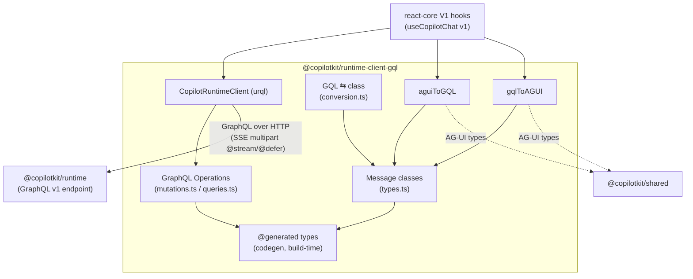

# @copilotkit/runtime-client-gql

The **V1 (legacy) GraphQL client** for talking to a CopilotKit [[@copilotkit/runtime]] over its Type-GraphQL endpoint. It wraps `urql`, defines the `generateCopilotResponse` streaming mutation and the `availableAgents` / `loadAgentState` queries, ships the message classes the V1 React layer uses (`TextMessage`, `ActionExecutionMessage`, `ResultMessage`, `AgentStateMessage`, `ImageMessage`), and converts between those GraphQL message shapes and the AG-UI message shapes from [[@copilotkit/shared]].

Published as `@copilotkit/runtime-client-gql` at **v1.57.4** (public, `@copilotkit/` scope). This is part of the **V1 stack** — it is consumed by the V1 hooks/contexts in [[@copilotkit/react-core]] (e.g. [[react-core - useCopilotChat (v1)]]). The V2 stack does **not** use GraphQL: it streams [[AG-UI Protocol]] events over SSE / the [[Intelligence Platform vs SSE|Intelligence Platform]] instead and talks to [[runtime - CopilotRuntime (v2)]] directly through [[@copilotkit/core]].

## Entry points / exports

`package.json` declares a single export `.` (`dist/index.mjs` / `dist/index.cjs`, types `dist/index.d.cts`) plus a UMD build (`CopilotKitRuntimeClientGQL` global). `src/index.ts` re-exports three barrels:

```ts
export * from "./client";                       // client + message classes + conversion helpers
export * from "./graphql/@generated/graphql";   // codegen output (build-time, see below)
export * from "./message-conversion";           // aguiToGQL / gqlToAGUI
export type { LangGraphInterruptEvent } from "./client";
```

`src/client/index.ts` additionally re-exports `convertMessagesToGqlInput`, `convertGqlOutputToMessages`, `filterAdjacentAgentStateMessages`, `filterAgentStateMessages`, `loadMessagesFromJsonRepresentation` from `conversion.ts`, and re-exports `GraphQLError` from `graphql`.

## Subsystems

- **Client** — [[runtime-client-gql - CopilotRuntimeClient]]: the `urql`-backed client class, fetch wrapper with version-mismatch detection, and `asStream` (urql `OperationResultSource` → `ReadableStream`).
- **GraphQL operations** — [[runtime-client-gql - GraphQL Operations]]: the `generateCopilotResponse` mutation (`@stream`/`@defer`) and the `availableAgents` / `loadAgentState` queries.
- **Message classes & GQL ⇆ JSON conversion** — defined in `src/client/types.ts` and `src/client/conversion.ts`: the `Message` hierarchy plus `convertMessagesToGqlInput` / `convertGqlOutputToMessages` (with streaming-tolerant arg parsing via `untruncate-json`).
- **AG-UI ⇆ GQL conversion** — [[runtime-client-gql - aguiToGQL]] and [[runtime-client-gql - gqlToAGUI]]: bridge between the AG-UI message types in [[@copilotkit/shared]] and this package's GQL message classes.
- **Generated types** — [[runtime-client-gql - Generated Types]]: GraphQL Code Generator client-preset output, produced at build time from the runtime's schema snapshot (not committed).
- **Interrupt event** — [[runtime-client-gql - LangGraphInterruptEvent]]: the typed meta-event surfaced for LangGraph human-in-the-loop interrupts.

## Key symbols

- [[runtime-client-gql - CopilotRuntimeClient]] — `class CopilotRuntimeClient` (`generateCopilotResponse`, `availableAgents`, `loadAgentState`, `asStream`, static `removeGraphQLTypename`).
- `Message` / `TextMessage` / `ActionExecutionMessage` / `ResultMessage` / `AgentStateMessage` / `ImageMessage` — message classes (`src/client/types.ts`); `Role` alias of `MessageRole`.
- [[runtime-client-gql - aguiToGQL]] / [[runtime-client-gql - gqlToAGUI]] — bidirectional message conversion.
- `convertMessagesToGqlInput` / `convertGqlOutputToMessages` / `filterAgentStateMessages` / `filterAdjacentAgentStateMessages` / `loadMessagesFromJsonRepresentation` — GQL ⇆ class conversion helpers (`src/client/conversion.ts`).
- [[runtime-client-gql - LangGraphInterruptEvent]] — `langGraphInterruptEvent()` factory + `LangGraphInterruptEvent<TValue>` / `MetaEvent` types.

## Depends on / depended on by

- **Depends on:** [[@copilotkit/shared]] (`workspace:*` — AG-UI message types, `randomId`, `parseJson`, error classes like `CopilotKitVersionMismatchError`, `getPossibleVersionMismatch`), `urql` + `@urql/core` (GraphQL transport), `untruncate-json` (streaming JSON repair), `graphql` (re-exports `GraphQLError`). Peer: `react`.
- **Build-time:** the codegen schema is read from the [[@copilotkit/runtime]] package (`../runtime/__snapshots__/schema/schema.graphql`); `project.json` declares `implicitDependencies: ["@copilotkit/runtime"]`.
- **Depended on by:** the V1 layer of [[@copilotkit/react-core]] (legacy hooks/contexts). It is **not** used by the V2 path.

## Build / test

- **Bundler:** [[runtime-client-gql - Generated Types|graphql-codegen]] runs first (`graphql-codegen -c codegen.ts`), then **tsdown** (`unbundle: true`; ESM+CJS with `.d.ts`, plus a separate UMD build). `react` and `@graphql-typed-document-node/core` are externalized; tests are excluded from the bundle.
- **Tests:** **vitest** (`vitest run`); codegen runs before tests too. Test files live beside sources: `client/__tests__/conversion.test.ts`, `message-conversion/agui-to-gql.test.ts`, `gql-to-agui.test.ts`, `roundtrip-conversion.test.ts`.


