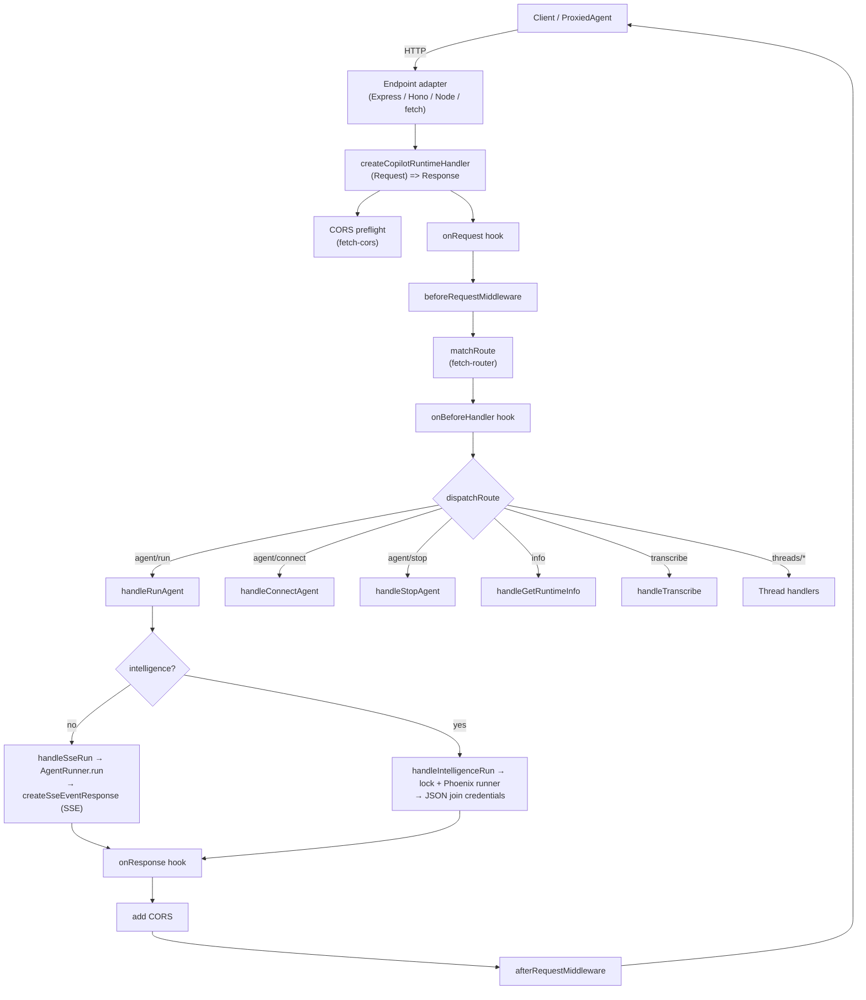

# @copilotkit/runtime

The server-side layer of CopilotKit: it sits between the [[Three-Layer Architecture|frontend]] and the [[AgentRunner|agents]], receiving HTTP requests over the [[AG-UI Protocol]], driving agent runs, and streaming events back. Published as `@copilotkit/runtime` at **v1.57.4** (MIT, public).

This package is **dual-architecture**. This folder documents the **current V2** (`src/v2/`). The legacy **V1** (Type-GraphQL schema/resolvers + 9 LLM service adapters + framework integrations) and the Vercel-AI-SDK-powered [[runtime - BuiltInAgent]] are documented in the V1/adapters/agent set ([[runtime - GraphQL Layer (v1)]], [[runtime - Service Adapter (interface)]], [[runtime - BuiltInAgent]], …).

## Entry points / exports

From `package.json#exports`:
- `.` — V1 root (GraphQL `CopilotRuntime`, service adapters, `@copilotkit/runtime` legacy surface).
- `./langgraph` — V1 [[runtime - LangGraphAgent (v1)]] helpers.
- `./v2` — V2 surface (`src/v2/index.ts` → re-exports `./runtime` + the merged `../agent`).
- `./v2/express` — `src/v2/express.ts` → `createCopilotExpressHandler` & single-route variant ([[runtime - Endpoints (Express/Hono/Node)]]).
- `./v2/hono` — `src/v2/hono.ts` → `createCopilotHonoHandler` & single-route variant.
- `./v2/node` — `src/v2/node.ts` → `createCopilotNodeListener` / `createCopilotNodeHandler`.

The V2 barrel (`src/v2/runtime/index.ts`) re-exports the runtime classes, [[runtime - createCopilotRuntimeHandler]], all endpoints, the runner family, the transcription service, the [[runtime - Intelligence Platform Client]], and the hook/CORS types.

## Two runtime modes

V2 has **two operating modes**, selected by whether `intelligence` is passed to [[runtime - CopilotRuntime (v2)]]:
- **SSE mode** (default) — runs agents in-process via an [[runtime - AgentRunner (base)|AgentRunner]] (default [[runtime - InMemoryAgentRunner]]) and streams events back as Server-Sent Events ([[runtime - SSE Streaming]]). Threads live in memory.
- **Intelligence mode** — delegates run/connect to the [[runtime - Intelligence Platform Client|CopilotKit Intelligence platform]] over a Phoenix WebSocket runner, with durable threads, locks, and realtime channels. See [[Intelligence Platform vs SSE]].

## Subsystems & key symbols (this folder)

- [[runtime - CopilotRuntime (v2)]] — the runtime config object (SSE vs Intelligence delegate).
- [[runtime - createCopilotRuntimeHandler]] — the framework-agnostic `(Request) => Promise<Response>` factory and pipeline.
- [[runtime - Routing & CORS]] — URL/route matching (`fetch-router`) and the built-in CORS utility (`fetch-cors`).
- [[runtime - Middleware (v2)]] — `beforeRequestMiddleware` / `afterRequestMiddleware` and the auto-applied agent middlewares (A2UI, MCP Apps, OpenGenerativeUI).
- [[runtime - Hooks & Debug Event Bus]] — `onRequest`/`onBeforeHandler`/`onResponse`/`onError` hooks and the in-process `DebugEventBus`.
- [[runtime - AgentRunner (base)]] — the abstract run/connect/stop/isRunning contract.
- [[runtime - InMemoryAgentRunner]] — the default in-process runner + local thread store.
- [[runtime - Endpoints (Express/Hono/Node)]] — framework adapters wrapping the fetch handler.
- [[runtime - Handlers (run/connect/stop)]] — per-route agent handlers.
- [[runtime - Thread Handlers]] — list/update/archive/delete/messages/events/state/clear.
- [[runtime - Transcribe Handler]] — audio→text endpoint (uses [[@copilotkit/voice]]).
- [[runtime - Intelligence Platform Client]] — `CopilotKitIntelligence` REST client + `IntelligenceAgentRunner`.
- [[runtime - SSE Streaming]] — the `createSseEventResponse` event encoder/stream.

## V1, adapters & agent (Set B)

The legacy/adapter surface in this folder (documented by the companion agent), all part of this package:

- [[runtime - BuiltInAgent]] — the Vercel-AI-SDK-powered agent (lives in `src/agent/`, merged into the V2 export) · [[runtime - AI SDK Converters]].
- Service adapters (V1): [[runtime - Service Adapter (interface)]] · [[runtime - OpenAI Adapter]] · [[runtime - OpenAI Assistant Adapter]] · [[runtime - Anthropic Adapter]] · [[runtime - Google GenAI Adapter]] · [[runtime - Groq Adapter]] · [[runtime - LangChain Adapter]] · [[runtime - Bedrock Adapter]] · [[runtime - Unify Adapter]] · [[runtime - Ollama Adapter (experimental)]].
- V1 core: [[runtime - GraphQL Layer (v1)]] · [[runtime - LangGraphAgent (v1)]] · [[runtime - Framework Integrations (v1)]] · [[runtime - Logging (Pino)]].

## Depends on / depended on by

- Depends on [[@copilotkit/shared]] (types, telemetry, `resolveDebugConfig`, `finalizeRunEvents`, logger), `@copilotkit/license-verifier` (external), and the `@ag-ui/*` family (`client`, `core`, `encoder`, `langgraph`, `a2ui-middleware`, `mcp-apps-middleware`). V2 uses the Vercel **AI SDK** (`ai`, `@ai-sdk/*`) via the [[runtime - BuiltInAgent]].
- Optional runner backends extend the base: [[@copilotkit/sqlite-runner]], [[@copilotkit/agentcore-runner]].
- The frontend reaches it via [[core - ProxiedCopilotRuntimeAgent]] / [[core - IntelligenceAgent]] (in [[@copilotkit/core]]); the legacy GraphQL surface is consumed by [[@copilotkit/runtime-client-gql]].

## Build / test

- Bundler: **tsdown** (`build` first runs `generate-graphql-schema` for V1).
- Tests: **vitest** (`vitest run`), with an extensive `src/v2/runtime/__tests__/` integration suite (Express/Hono/Node/Bun/Elysia servers, single- vs multi-route, telemetry, middleware, CORS).

## V2 request flow

