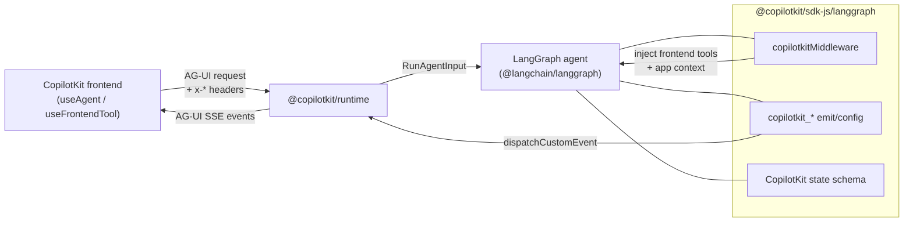

# @copilotkit/sdk-js

TypeScript **agent-side SDK** for building [[AG-UI Protocol]] agents on **LangGraph / LangChain**. It is the JS counterpart to the Python `copilotkit` SDK (`[[sdk-python - overview]]`) — both expose the same `copilotkit_*` primitives so an agent can emit messages, tool calls, and intermediate state back to a CopilotKit frontend, and surface CopilotKit frontend tools and context into the model.

Published as `@copilotkit/sdk-js` at **v1.57.4**, ESM-first (`"type": "module"`), `sideEffects: false`. Bundled with **tsdown**, tested with **vitest**. Runtime dep: `@ag-ui/langgraph` (`0.0.31`) and `[[@copilotkit/shared]]`. `@langchain/core`, `@langchain/langgraph`, `langchain`, and `zod` are **peer dependencies** (the consumer owns the LangChain version).

## Entry points / exports

The `package.json` `exports` map defines four subpaths:

| Subpath | File | Contents |
| --- | --- | --- |
| `.` (root) | `src/index.ts` | **Only** re-exports `withForwardedHeaders` + `getForwardedHeaders` from `header-propagation`. (Despite the JSDoc examples that `import { copilotkitCustomizeConfig } from "@copilotkit/sdk-js"`, those utils are exported from the `/langgraph` subpath, not the root.) |
| `./langgraph` | `src/langgraph/index.ts` | The main agent toolkit — re-exports `./types`, `./utils`, `./middleware`, `./state-schema`. |
| `./langchain` | `src/langchain.ts` | **Deprecated** compatibility shim — logs a deprecation `console.warn` on import and re-exports a `copilotKit*`-cased alias surface from `./langgraph`. Use `./langgraph` instead. |
| `./langgraph-middlewares` | `src/langgraph-middlewares.ts` | One line: `export * from "@ag-ui/langgraph/middlewares"` — passthrough to the AG-UI LangGraph middleware bundle. |

## Subsystems & key symbols

- [[sdk-js - langgraph utils (copilotkitCustomizeConfig/Emit*)]] — the `copilotkit_*` emit/config primitives (`src/langgraph/utils.ts`).
- [[sdk-js - createCopilotkitMiddleware]] — the LangChain `createMiddleware` agent middleware that injects frontend tools, app context, and forwards headers (`src/langgraph/middleware.ts`).
- [[sdk-js - zodState]] — Standard-Schema augmentation so Zod state fields survive into the graph `output_schema` / AG-UI `STATE_SNAPSHOT` (`src/langgraph/middleware.ts`).
- [[sdk-js - CopilotKit state annotations]] — `CopilotKitStateAnnotation` / `CopilotKitPropertiesAnnotation` / `CopilotKitStateSchema` and the `copilotkit` state field shape (`src/langgraph/types.ts`, `src/langgraph/state-schema.ts`).
- [[sdk-js - convertActionsToDynamicStructuredTools]] — turn CopilotKit action descriptors into LangChain `DynamicStructuredTool`s (`src/langgraph/utils.ts`).
- [[sdk-js - copilotKitInterrupt]] — human-in-the-loop interrupt helper over LangGraph `interrupt()` (`src/langgraph/utils.ts`).
- [[sdk-js - header-propagation]] — `AsyncLocalStorage`-based `x-*` header forwarding from the AG-UI request into outgoing LLM calls (`src/header-propagation.ts`).

## Depends on

- `[[@copilotkit/shared]]` — `convertJsonSchemaToZodSchema`, `randomId`, `CopilotKitMisuseError`.
- `@ag-ui/langgraph` (external, AG-UI family) — re-exported middlewares; the AG-UI LangGraph agent adapter that actually runs these graphs lives outside this repo.
- Peer: `langchain`, `@langchain/core`, `@langchain/langgraph`, `zod`.

## Depended on by

- LangGraph-JS demo/example agents under `examples/` and `showcase/integrations/` that target CopilotKit. The agent is then exposed to the runtime as an [[AgentRunner]]-driven [[AG-UI Protocol]] endpoint.

## How it fits

The SDK never speaks HTTP itself — it shapes the LangGraph run (config metadata, state schema, middleware, custom events) so that the AG-UI LangGraph adapter and `[[@copilotkit/runtime]]` translate the run into the [[AG-UI Protocol]] event stream the frontend consumes.
