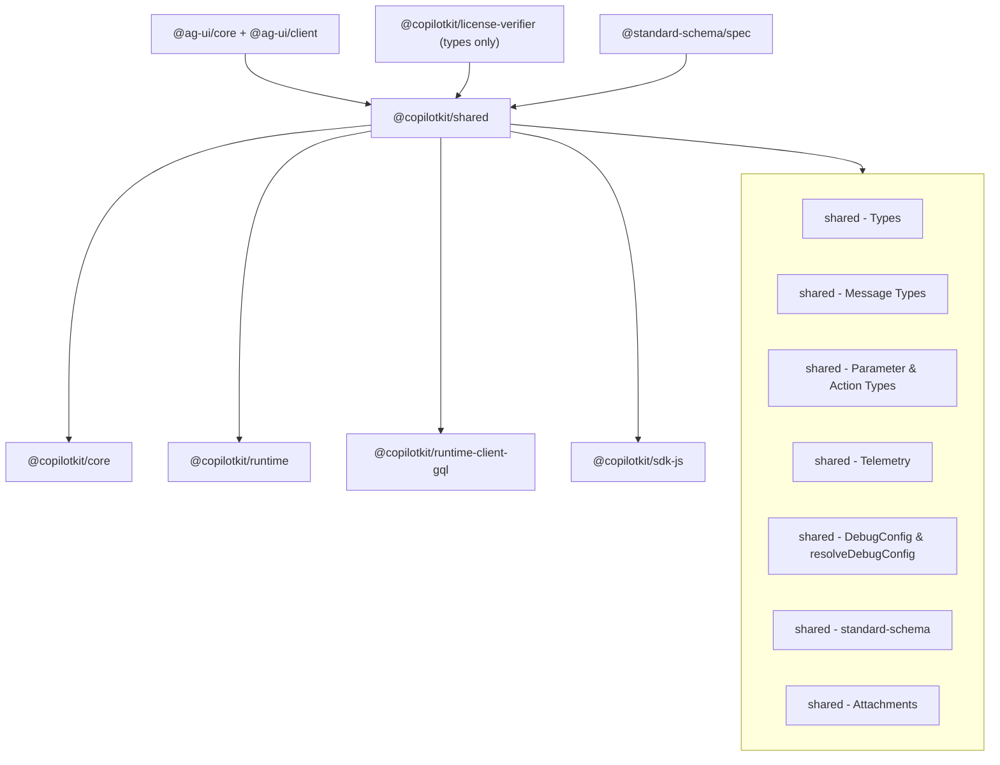

# @copilotkit/shared

The framework-agnostic foundation layer. A single flat barrel of **types, type-conversion utilities, telemetry, debug config, schema bridging, attachment helpers, error classes, and constants** that every other CopilotKit package imports. It has **no React/Vue/Angular dependency** and no opinion about transport — it only knows about the [[AG-UI Protocol]] (`@ag-ui/core` / `@ag-ui/client`) and standard schema/JSON-Schema shapes.

Published as **`@copilotkit/shared` v1.57.4** (MIT, public, `"type": "module"`, `sideEffects: false`). It sits beneath the [[Three-Layer Architecture]]: consumed by the frontend layer ([[@copilotkit/core]], [[@copilotkit/react-core]], [[@copilotkit/vue]], [[@copilotkitnext/angular]]), the runtime layer ([[@copilotkit/runtime]], [[@copilotkit/runtime-client-gql]]), and the agent SDK ([[@copilotkit/sdk-js]]).

## Entry points / exports

Single entry (`.` → `dist/index.mjs` / `dist/index.cjs`; types `dist/index.d.cts`; UMD for unpkg/jsdelivr). `src/index.ts` re-exports everything via wildcard barrels:

- `export * from "./types"` — message, action/parameter, error, cloud-config, utility, openai-assistant types ([[shared - Types]], [[shared - Message Types]], [[shared - Parameter & Action Types]]).
- `export * from "./utils"` — JSON-Schema conversion, JSON parsing, ids, request body reading, error classes, clipboard, conditions, console-styling.
- `export * from "./constants"` — Copilot Cloud URLs/headers, `DEFAULT_AGENT_ID`, `AG_UI_CHANNEL_EVENT`.
- `export * from "./telemetry"` — [[shared - Telemetry]] (`TelemetryClient`, `lambdaClient`, telemetry-id parsing).
- `export * from "./debug"` — [[shared - DebugConfig & resolveDebugConfig]].
- `export * from "./standard-schema"` — [[shared - standard-schema (schemaToJsonSchema)]].
- `export * from "./attachments"` — [[shared - Attachments]].
- Named: `logger` (just `console`), `finalizeRunEvents`, transcription error helpers, `COPILOTKIT_VERSION` (read from `package.json`), `createLicenseContextValue`, A2UI default prompt strings, and **type-only** re-exports from `@copilotkit/license-verifier` (`LicenseChecker`, `LicenseStatus`, `LicensePayload`, …) plus `DebugEventEnvelope`.

> License note: only **types** are re-exported from `@copilotkit/license-verifier` (types are erased at compile time, so the Node-only `crypto` dependency never reaches browser bundles). `createLicenseContextValue(null)` is inlined here so the unlicensed/client path needs no verifier bundle. See [[Telemetry & Licensing]].

## Subsystems & symbols

- [[shared - Types]] — the umbrella `src/types/` barrel (error classes via `src/utils/errors.ts`, cloud config, utility generics, openai-assistant tool shapes).
- [[shared - Message Types]] — AG-UI message re-exports + CopilotKit message extensions (`AIMessage`, `ToolResult`, the `Message` union).
- [[shared - Parameter & Action Types]] — the `Parameter` discriminated union, `Action<T>`, and the `MappedParameterTypes` type-level mapper; plus JSON-Schema ↔ Parameter ↔ Zod conversion.
- [[shared - Telemetry]] — `TelemetryClient`, the telemetry-sink `lambdaClient`, `flattenObject`, env opt-outs, sampling.
- [[shared - DebugConfig & resolveDebugConfig]] — `DebugConfig` union and its normalizer (the implementation behind the concept note [[DebugConfig]]).
- [[shared - standard-schema (schemaToJsonSchema)]] — Standard Schema V1 → JSON Schema bridge with Zod v3/v4 fallbacks.
- [[shared - Attachments]] — multimodal attachment config/types and file helpers, built on AG-UI `InputContent`.

Other notable members exported but not given their own note: `finalizeRunEvents` (synthesizes missing terminal AG-UI events for an aborted/incomplete stream — see [[Request Lifecycle]]), the transcription error enum/helpers (consumed by [[@copilotkit/voice]] and the runtime transcribe handler), `DebugEventEnvelope` (`{ timestamp, agentId, threadId, runId, event }`, consumed by [[Debug Mode]] tooling), `RuntimeInfo`/`RuntimeMode`/`AgentDescription` (the `/info` payload shape, `RUNTIME_MODE_SSE` vs `RUNTIME_MODE_INTELLIGENCE` — see [[Intelligence Platform vs SSE]]), `randomId`/`randomUUID`/`dataToUUID`/`isValidUUID`, `parseJson`/`partialJSONParse`/`safeParseToolArgs`, `phoenixExponentialBackoff`, and the A2UI default prompt strings (`A2UI_DEFAULT_GENERATION_GUIDELINES`, `A2UI_DEFAULT_DESIGN_GUIDELINES` — see [[A2UI (Generative UI)]]).

## Depends on / depended on by

- **Depends on:** `@ag-ui/core` (peer, `>=0.0.48`) + `@ag-ui/client` for the [[AG-UI Protocol]] base types/events; `@copilotkit/license-verifier` (types only); `@segment/analytics-node`, `@standard-schema/spec`, `chalk`, `graphql` (the `CopilotKitError` base class extends `GraphQLError`), `partial-json`, `uuid`, `zod`, `zod-to-json-schema`.
- **Depended on by:** essentially all in-repo packages — [[@copilotkit/core]], [[@copilotkit/runtime]], [[@copilotkit/runtime-client-gql]], [[@copilotkit/react-core]], [[@copilotkit/react-ui]], [[@copilotkit/vue]], [[@copilotkitnext/angular]], [[@copilotkit/sdk-js]], [[@copilotkit/voice]], and the runner packages.

## Build / test

- **Bundler:** `tsdown` (`build`/`dev --watch`). **Types check:** `tsc --noEmit`. Validation: `publint`, `attw`.
- **Tests:** `vitest run`. Test files live alongside source under `src/**/__tests__/` and `src/*.test.ts` (debug, standard-schema, zod-regression, message, attachments/utils, telemetry lambda/client, json-schema, clipboard).

