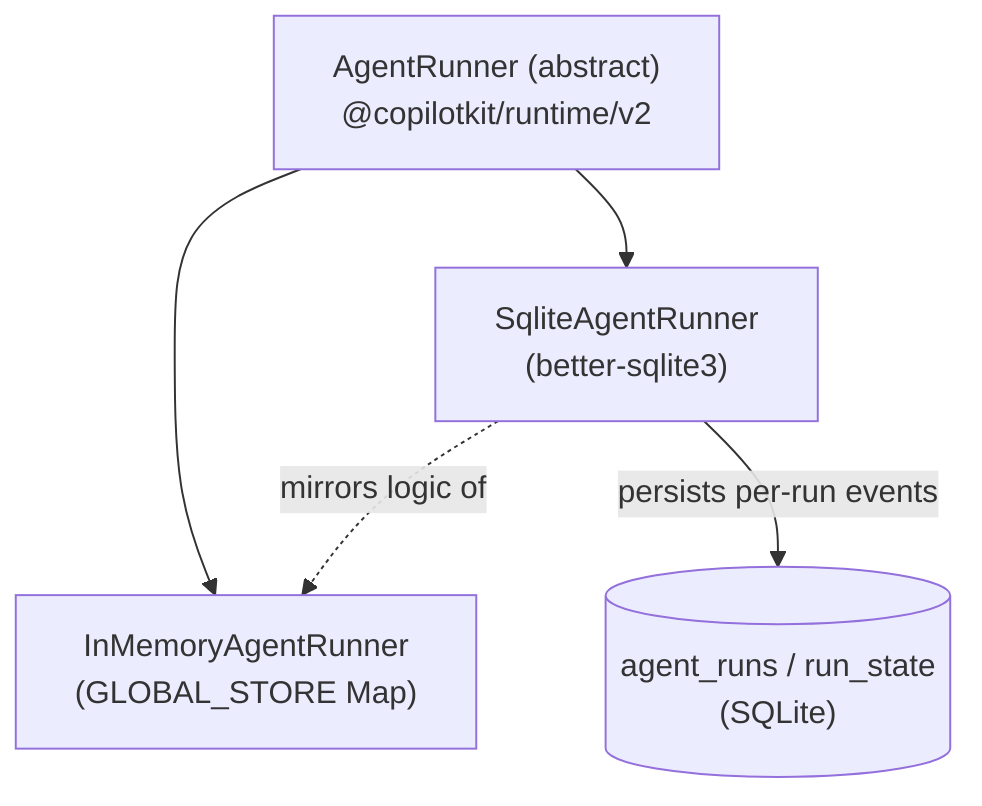

# @copilotkit/sqlite-runner

A **SQLite-backed [[AgentRunner]]** for the [[@copilotkit/runtime]] V2 runtime. It gives a thread's [[AG-UI Protocol]] event history durable storage in a SQLite database (file or `:memory:`), so threads survive process restarts — the persistent counterpart to [[runtime - InMemoryAgentRunner]].

Published as `@copilotkit/sqlite-runner` at **v1.57.4** (`package.json` description: "SQLite-backed agent runner for CopilotKit2"). ESM-first, single export (`.`). Built with **tsdown**, tested with **vitest**.

## Exports

`src/index.ts` re-exports everything from `./sqlite-runner`: the `SqliteAgentRunner` class, the `SqliteAgentRunnerOptions` interface (`{ dbPath?: string }`), and the `AgentRunRecord` row type.

## Dependencies

- `[[@copilotkit/runtime]]` (`workspace:*`) — imports `AgentRunner`, `finalizeRunEvents`, and the four request types from `@copilotkit/runtime/v2`.
- `@ag-ui/client` (`0.0.53`) — `AbstractAgent`, `BaseEvent`, `RunAgentInput`, `EventType`, `RunStartedEvent`, `compactEvents`.
- `rxjs` (`7.8.1`) — `Observable`, `ReplaySubject`.
- `better-sqlite3` — an **optional peer dependency** (`peerDependenciesMeta.optional: true`); the constructor throws a helpful install message if it is missing. `engines.node >= 18`.

## Subsystems

- [[sqlite-runner - SqliteAgentRunner]] — the `AgentRunner` subclass: `run`/`connect`/`isRunning`/`stop` plus a `close()` for the DB handle.
- [[sqlite-runner - schema & run-chaining]] — the `agent_runs` / `run_state` / `schema_version` tables, the recursive parent→child run-chain query, and event compaction/dedup.

## How it relates to the in-memory runner

`SqliteAgentRunner` is **not** a subclass of `InMemoryAgentRunner` — both extend the abstract [[runtime - AgentRunner (base)]] directly. The SQLite runner deliberately mirrors the in-memory runner's streaming/dedup logic (same `ACTIVE_CONNECTIONS` pattern, same `compactEvents`/`finalizeRunEvents` usage) but swaps the in-process `GLOBAL_STORE` map for real tables. Contrast with [[@copilotkit/agentcore-runner]], which *does* subclass the in-memory runner.

## Build/test

tsdown bundle (`build`/`dev --watch`), vitest (`test`, `test:coverage`), `publint` + `attw` packaging checks. Tests live in `packages/sqlite-runner/src/__tests__/`.
