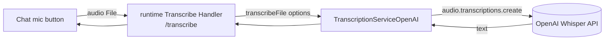

# @copilotkit/voice

Audio **transcription** providers for CopilotKit. Published as **`@copilotkit/voice`** at **v1.57.4** (public). This package overview doubles as the folder MOC.

> [!important] Transcription only — no TTS in code
> The `package.json` description reads "Voice services for CopilotKit (transcription, text-to-speech, etc.)", but the source ships **only OpenAI Whisper transcription**. There is no text-to-speech implementation in this package. State what exists: one class, [[voice - TranscriptionServiceOpenAI]].

## Entry points / exports

- `package.json` `exports["."]` → `dist/index.mjs` (import) / `dist/index.cjs` (require); also `main`/`module`/`types` and a UMD build (`dist/index.umd.js`, global `CopilotKitVoice`).
- `src/index.ts` re-exports everything from `./transcription/transcription-service-openai` — i.e. `TranscriptionServiceOpenAI` and its config interface `TranscriptionServiceOpenAIConfig`.

## Notes in this folder

- [[voice - TranscriptionServiceOpenAI]] — the sole exported class; an OpenAI Whisper implementation of the runtime's `TranscriptionService`.

## How it fits

The class **extends `TranscriptionService`** imported from **`@copilotkit/runtime/v2`** (the abstract base lives at `packages/runtime/src/v2/runtime/transcription-service/transcription-service.ts`). You pass an instance to the V2 [[runtime - CopilotRuntime (v2)]] as `transcriptionService`; the runtime's [[runtime - Transcribe Handler]] then calls `transcriptionService.transcribeFile(...)` for the `/transcribe` endpoint. The chat UI's microphone button (e.g. `usePushToTalk` in [[react-ui - hooks (useDarkMode/usePushToTalk)]]) records audio, the runtime transcribes it, and the text is inserted into the input.

## Depends on / depended on by

- **Depends on:** [[@copilotkit/runtime]] (`workspace:*`, for the `TranscriptionService` base + `TranscribeFileOptions` from the `/v2` entry), and `openai` (`^5.9.0`).
- **Depended on by:** opt-in by runtime consumers who want voice transcription; not a hard dependency of any core package.

## Build / test

- **Bundler:** tsdown — dual config: an unbundled ESM+CJS build (`target es2022`, `dts`, sourcemaps) plus a UMD build (`target es2018`, global `CopilotKitVoice`, with `@copilotkit/runtime`→`CopilotKitRuntime` and `openai`→`openai` externalized as globals).
- **Test:** vitest (`src/__tests__/smoke.test.ts` is a trivial load smoke test).
- **TS config:** `extends @copilotkit/typescript-config/base.json` — see [[typescript-config]].
