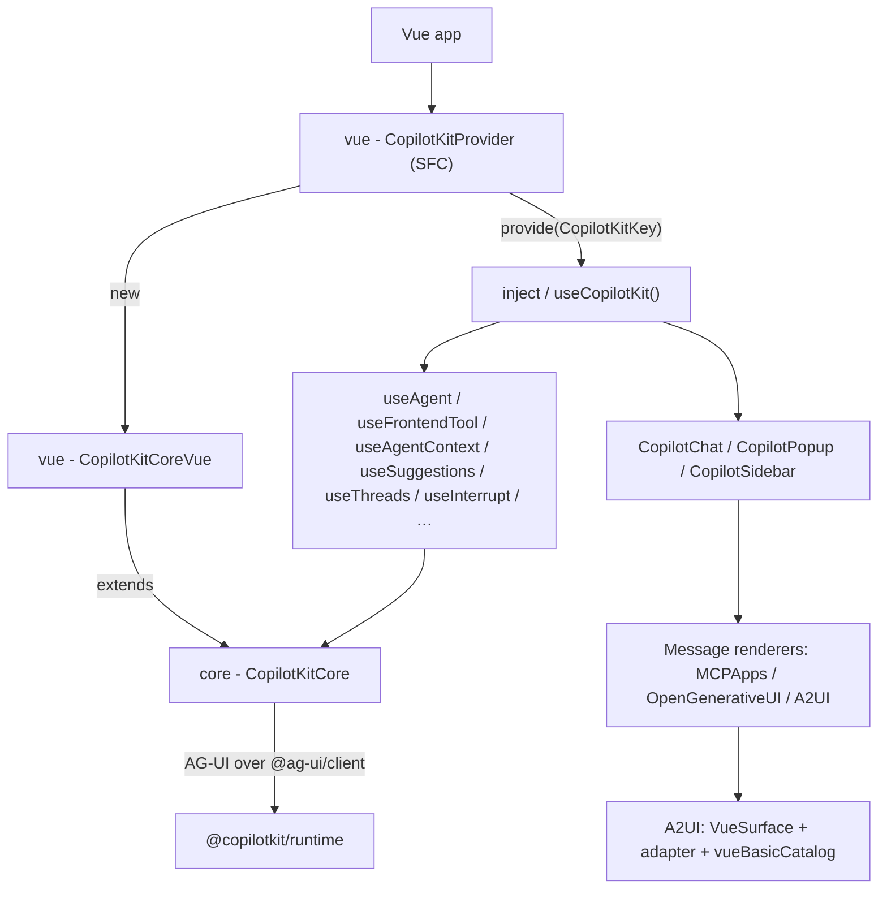

# @copilotkit/vue

Vue 3 components and composables for CopilotKit — the **Vue framework binding** over the framework-agnostic [[@copilotkit/core]], mirroring [[@copilotkit/react-core]]'s public surface for the Vue ecosystem. Published as **`@copilotkit/vue` v1.57.4** (MIT, `access: public`), peer-depends on `vue >=3.3.0`.

This is the folder MOC: it links every note in `02-Packages/vue/`.

## Role

CopilotKit's three layers are Frontend → Runtime → Agent (see [[Three-Layer Architecture]]). `@copilotkit/vue` is a **Frontend** binding: it wraps [[core - CopilotKitCore]] in a Vue-reactive subclass ([[vue - CopilotKitCoreVue]]), exposes it through a [[vue - CopilotKitProvider|provider]] using Vue `provide/inject`, and surfaces agent state, tools, context, suggestions, threads, interrupts and chat UI as **composables** and **single-file components**. It talks to the runtime over the [[AG-UI Protocol]] via `@ag-ui/client` (`HttpAgent`) and core's [[core - ProxiedCopilotRuntimeAgent]].

## V1 + V2 split

Like react-core, the package has an internal V1/V2 split (a GLOBAL CORRECTION):

- **`src/v2/`** — the modern implementation: providers, composables, types, chat components, A2UI. This is the bulk of the package.
- **`src/`** (V1 compat) — thin backward-compat wrappers: re-exports all of `./v2`, then **shadows** a few exports with legacy `Parameter[]`-based APIs. See [[vue - V1 compat layer]].

## Entry points / exports

From `package.json#exports` + `vite.config.ts` (two library entries, ESM + CJS):

| Subpath | Source | Contents |
|---|---|---|
| `.` | `src/index.ts` | V1 compat entry — re-exports `./v2` then overrides `useCopilotAction`, `useFrontendTool`, `useCopilotReadable`, `CopilotKit` (component) |
| `./v2` | `src/v2/index.ts` | Modern entry — re-exports `@copilotkit/core` + `@ag-ui/client`, plus local components/hooks/providers/types/lib |
| `./styles.css` | built CSS | Tailwind v4 stylesheet (`cpk:`-prefixed utilities) |

`src/v2/index.ts` re-exports **`@copilotkit/core`** and **`@ag-ui/client`** wholesale, so consumers get `CopilotKitCore`, `FrontendTool`, `AbstractAgent`, etc. from `@copilotkit/vue/v2` directly.

## Subsystems

- [[vue - Providers & injection keys]] — `provide/inject` graph: `CopilotKitKey`, `CopilotChatConfigurationKey`, `SandboxFunctionsKey`, `LicenseContextKey`, and their accessor composables.
- [[vue - Chat components]] — the `CopilotChat` / `CopilotPopup` / `CopilotSidebar` SFC family + sub-slots.
- [[vue - Message renderers]] — `MCPAppsActivityRenderer`, `OpenGenerativeUIRenderer`, `A2UIMessageRenderer`, and the tool/custom/activity renderer type system.
- [[vue - A2UI (VueSurface/adapter/catalog)]] — Vue-native [[A2UI (Generative UI)]] rendering over `@a2ui/web_core`.
- [[vue - V1 compat layer]] — legacy `useCopilotAction` / `useFrontendTool` / `useCopilotReadable` / `CopilotKit`.

## Key symbols

Core & provider:
- [[vue - CopilotKitCoreVue]] — the Vue subclass of [[core - CopilotKitCore]].
- [[vue - CopilotKitProvider]] — the root provider SFC.

Composables:
- [[vue - useAgent]] · [[vue - useFrontendTool]] · [[vue - useAgentContext]]
- [[vue - composables (suggestions/interrupt/threads/…)]] — `useHumanInTheLoop`, `useInterrupt`, `useSuggestions`, `useConfigureSuggestions`, `useThreads`, `useAttachments`, `useRenderTool`, `useDefaultRenderTool`, `useComponent`, `useCapabilities`, `useRenderActivityMessage`, `useRenderCustomMessages`, `useKeyboardHeight`, `useKatexStyles`.

## Depends on / depended on by

**Depends on** (workspace): [[@copilotkit/core]], [[@copilotkit/shared]], [[@copilotkit/web-inspector]]. **External deps**: `@ag-ui/client`, `@ag-ui/core`, `@a2ui/web_core` (A2UI primitives), `@jetbrains/websandbox` (Open Generative UI iframe sandbox), `zod` + `zod-to-json-schema`, `katex`, `lucide-vue-next`, `streamdown-vue` (markdown). **Peer**: `vue >=3.3.0`.

**Depended on by**: Vue example apps (e.g. `examples/v2/vue/**`). It is the Vue analogue of [[@copilotkit/react-core]] + [[@copilotkit/react-ui]] combined (no separate `vue-ui` package — see PARITY.md).

## Build / test

- **Bundler: `vite`** (a GLOBAL CORRECTION — most packages use tsdown; vue uses vite). Library mode, two entries (`index`, `v2/index`), ESM (`.mjs`) + CJS (`.cjs`). Types via `vue-tsc`. CSS built with the Tailwind v4 CLI then scope-checked by `scripts/scope-preflight.mjs`.
- **Tests: `vitest`** with `jsdom` + `@vue/test-utils` / `@testing-library/vue`. Extensive `__tests__` dirs (unit + `.e2e.test.ts`).
- Parity policy: React (`react-core`/`react-ui`/`react-textarea`) is the canonical behavioral reference; `PARITY.md` tracks the React→Vue matrix and mandates word-for-word mirrored test names.

