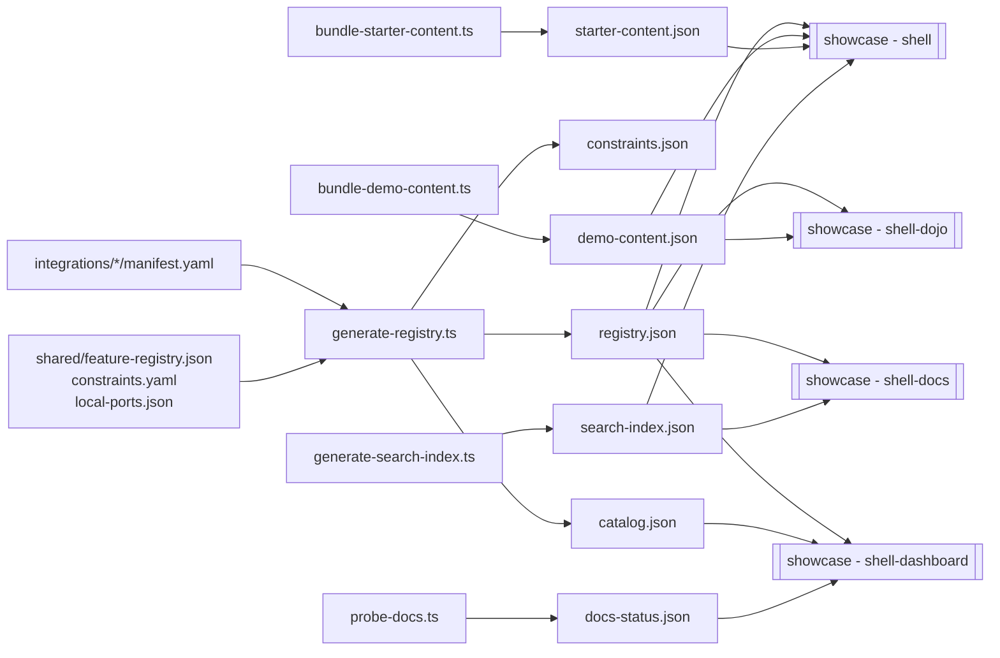

# Apps MOC

Map of the **Showcase Platform** (`showcase/`) — a self-contained, multi-app system that demos CopilotKit across many agent frameworks. It is **not** part of the published `packages/` and is **not** built by the monorepo's package pipeline; it ships as a set of Docker images deployed to **Railway** from `main`.

> **What is the showcase?** Per-framework demos of CopilotKit (LangGraph, CrewAI, Mastra, Claude Agent SDK, etc.). Each integration is a Next.js frontend + agent backend bundled into a Docker image. A set of "shell" Next.js apps (hub, dojo, docs, dashboard) provide the gallery/navigation surfaces, fed by **build-time-generated JSON** derived from every integration's `manifest.yaml`.

## Apps in this folder

- [[showcase - shell]] — the hub gallery app. **The only app that uses CopilotKit** (via `@copilotkitnext/*` on the `next` dist-tag).
- [[showcase - shell-dashboard]] — internal feature × integration ops/parity grid (port 3002). No CopilotKit.
- [[showcase - shell-docs]] — the Fumadocs documentation site that ships from this repo (port 3003). No CopilotKit runtime.
- [[showcase - shell-dojo]] — interactive demo browser (port 3001). No CopilotKit runtime.
- [[showcase - harness]] — in-cluster observability service (probes, alerts, PocketBase, Slack).
- [[showcase - scripts]] — the build/codegen/validation/deploy toolchain shared by every app.
- [[showcase - tests (e2e-smoke)]] — Playwright smoke suite (`@showcase/e2e-smoke`) for deployed integrations + starters.
- [[showcase - eval-webhook]] — tiny GitHub App webhook that turns a PR check "Run eval" button into a workflow dispatch.
- [[showcase - aimock fixtures]] — deterministic LLM fixture data dir consumed by `@copilotkit/aimock` in CI/Railway.
- [[showcase - shared]] — canonical registry/constraints/ports + shared agent tools (TS + Python) + the starter template.

## Integration backends (one note per framework, `showcase/integrations/<slug>/`)

Eighteen integration directories are present (the README's "17" is stale — `ms-agent-python` is also present). Each is its own Next.js + agent Dockerized app. Notes for these are owned by another agent:

- [[showcase integration - ag2]]
- [[showcase integration - agno]]
- [[showcase integration - built-in-agent]]
- [[showcase integration - claude-sdk-python]]
- [[showcase integration - claude-sdk-typescript]]
- [[showcase integration - crewai-crews]]
- [[showcase integration - google-adk]]
- [[showcase integration - langgraph-fastapi]]
- [[showcase integration - langgraph-python]]
- [[showcase integration - langgraph-typescript]]
- [[showcase integration - langroid]]
- [[showcase integration - llamaindex]]
- [[showcase integration - mastra]]
- [[showcase integration - ms-agent-dotnet]]
- [[showcase integration - ms-agent-python]]
- [[showcase integration - pydantic-ai]]
- [[showcase integration - spring-ai]]
- [[showcase integration - strands]]

## CopilotKit usage at a glance

| App | Uses CopilotKit? | How |
| --- | --- | --- |
| [[showcase - shell]] | **Yes** | `@copilotkitnext/react` (UI) + `@copilotkitnext/runtime` + `@copilotkitnext/agent` (`BuiltInAgent`) on the **`next` dist-tag** — see [[@copilotkit vs @copilotkitnext]] |
| [[showcase - shell-dojo]] | No (renders demo source/preview only) | — |
| [[showcase - shell-docs]] | No runtime (docs content references it) | Fumadocs |
| [[showcase - shell-dashboard]] | No | Ops grid over [[showcase - harness]] |
| Integration backends | **Yes** (each mounts a CopilotKit runtime + agent) | per-framework, owned by integration notes |
| [[showcase - shared]] (starter template) | **Yes** (template wires a CopilotKit route) | `app/api/copilotkit/route.ts` |

The four "shell" apps are deliberately **independent Next.js apps** — none imports another shell's code or data directory. They share only the generated JSON contracts produced by [[showcase - scripts]] from [[showcase - shared]].

## Generated-data contract (the glue)

These JSON files are **gitignored** and regenerated on every build path (Docker, CI, `npm run dev`, `npm run build`). See [[showcase - scripts]] for each generator.

## Supporting infra (not given dedicated notes here)

- `showcase/pocketbase/` — PocketBase image + migrations backing [[showcase - harness]] and [[showcase - shell-dashboard]] live status.
- `showcase/bin/showcase` — unified bash CLI (`up`/`down`/`build`/`test`/`logs`/…) dispatching to `scripts/cli/cmd-*.sh`; see [[showcase - scripts]].
- `docker-compose.local.yml` / `.record.yml` / `.replay.yml` — local-stack orchestration (one service per package; ports from `shared/local-ports.json`).

## Related

- [[showcase integration]] backends are consumed by [[showcase - tests (e2e-smoke)]] and [[showcase - harness]] probes.
- The docs site here mirrors [[Docs-Site MOC]] (the `06-Docs-Site` area covers the same `shell-docs` content tree from the docs angle).
- Build/CI/deploy pipeline details live under [[Build-CI-Release MOC]].
