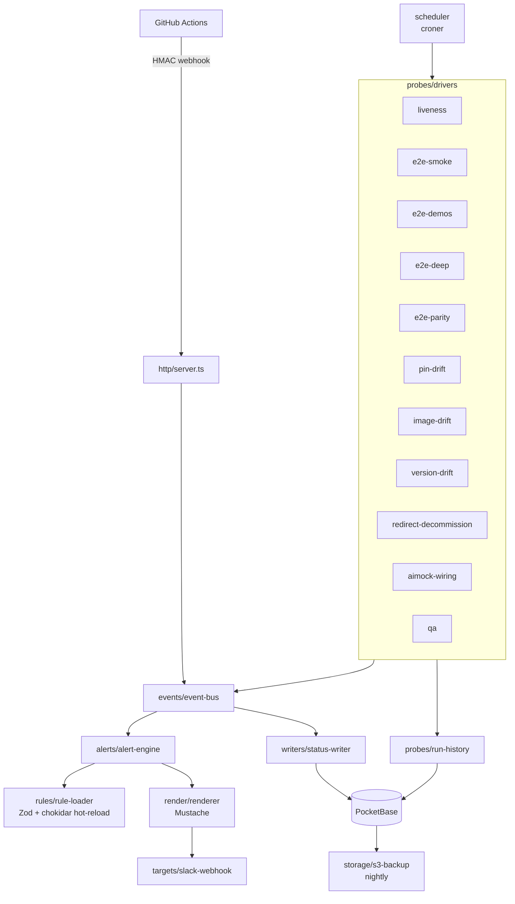

# showcase - harness

In-cluster **observability service** for the showcase fleet (`@copilotkit/showcase-harness`, private, ESM). A single long-lived Node process (Hono HTTP + cron scheduler) that runs on Railway, receives **signed webhooks** from GitHub Actions, executes **cron-driven probes**, persists state to **PocketBase**, classifies state transitions, and delivers **Slack alerts**. It replaces four legacy GitHub Actions cron workflows with one stateful process that can dedupe, rate-limit, and render rich templates. **No CopilotKit.**

Production URL (per README): `https://showcase-harness-production.up.railway.app`.

## HTTP surface (`src/http/`)

- `GET /health` — `{status, pb, loop, rules, schedulerJobs}`.
- `GET /metrics` — Prometheus exposition (`showcase_harness_probe_runs`, `..._alert_matches`, `..._alert_sends`, `..._rule_reloads`, `..._webhook_rejections{reason}`).
- `POST /webhooks/deploy` — HMAC-signed `deploy.result` ingest. Canonical payload `METHOD|PATH|TS|sha256(body)`, `X-Ops-Signature: sha256=<hex>`, 300s skew. Verifier in `src/http/hmac.ts` + `src/http/webhooks/deploy.ts`; auth in `src/http/auth.ts`.
- Plus the ops API consumed by [[showcase - shell-dashboard]] (probe schedule / trigger / status), proxied same-origin as `/api/ops/*`.

## Composition (`src/orchestrator.ts`)

`orchestrator.ts` wires everything at boot (the entry point; `start` runs `node dist/orchestrator.js`):

Subsystems (each a `src/` folder): `alerts/` (alert-engine, aggregation, DSL), `events/` (event-bus, transition-detector), `rules/` (Zod-validated YAML rule loader, hot-reload via chokidar/SIGHUP), `render/` (Mustache renderer + filters), `scheduler/` (croner), `storage/` (pb-client, alert-state-store, s3-backup), `targets/` (slack-webhook), `writers/` (status-writer), `probes/` (drivers + discovery + loader + run-history + run-tracker).

## Probes & alerts (config)

- **Probe configs:** `config/probes/*.yml` — `liveness`/`smoke`, `e2e-smoke`, `e2e-demos`, `e2e-deep`, `e2e-parity`, `image-drift`, `version-drift`, `pin-drift`, `redirect-decommission`, `aimock-wiring`, `qa`.
- **Alert rules:** `config/alerts/*.yml` (loader skips `_defaults.yml`) — red-tick + red-fleet rules per dimension (smoke/chat/agent/tools), `deploy-result`, `e2e-smoke-failure`, `image-drift`, `*-drift-weekly`, `redirect-decommission-monthly`, `aimock-wiring-drift`.
- **Discovery sources** (`probes/discovery/`): `railway-services`, `pnpm-packages` (parses every workspace `package.json` for version-drift), `caching-source`, `auth-tracker`.
- The **e2e drivers** launch Playwright (pooled launchers) and reuse the same flows as [[showcase - tests (e2e-smoke)]].

## Config / secrets

Read at boot (see README §1.2): `POCKETBASE_URL` (+ superuser creds), `SHARED_SECRET` (+ `SHARED_SECRET_PREV` for rotation), optional `AIMOCK_URL`, Railway token trio, `DASHBOARD_URL`, `REPO`, `S3_BACKUP_BUCKET`/`AWS_REGION`, `LOG_LEVEL`, `PORT` (default 8080), and one `SLACK_WEBHOOK_<ALIAS>` per rule alias.

## Build / test

- **Build:** `tsc -p tsconfig.build.json` (plain TS, ESM, no bundler).
- **Tests:** Vitest — unit (`*.test.ts`, co-located, extensive), integration (`vitest.integration.config.ts`), e2e (`vitest.e2e.config.ts`), golden updates via `UPDATE_GOLDENS=1`.
- **Docker:** `harness/Dockerfile` (node:22-alpine, pnpm) — copies every workspace `package.json` so the version-drift probe can read them, installs with `--filter @copilotkit/showcase-harness...`.
- **Extra scripts** (`scripts/`): `d6-capture-references.ts`, `load-test.ts`, `test-notify-harness-jq.sh`.

## Related

- Backs [[showcase - shell-dashboard]] (ops/status data over PocketBase + ops API).
- Re-runs the same e2e flows as [[showcase - tests (e2e-smoke)]]; aimock-wiring probe compares against [[showcase - aimock fixtures]].
- Persists to `showcase/pocketbase/` (image + migrations).
- [[Apps MOC]] · [[Build-CI-Release MOC]]
