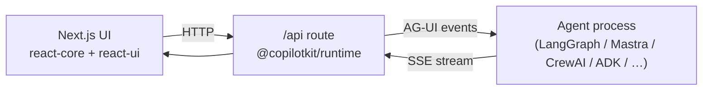

# Examples MOC

Map of `examples/` — 47 self-contained demo repositories consolidated into one directory. Each example is its own project (own `package.json`, lockfile, and README) showing CopilotKit wired to a specific agent framework or UI pattern. The top-level `examples/README.md` enumerates them across `canvas/`, `integrations/`, `showcases/`, `v1/`, `v2/`, and the `e2e/` harness.

> Scope of this MOC area: **canvas**, **integrations**, and the **e2e** smoke-test harness. The `showcases/`, `v1/` (legacy), and `v2/` (starter) example sets are mapped elsewhere in the KB.

## Categories

- [[Examples - canvas]] — 7 AI-powered canvas apps (visual card interfaces, real-time shared state, HITL).
- [[Examples - integrations]] — 17 framework-integration starters (LangGraph, Mastra, CrewAI, ADK, Agno, etc.).
- [[Examples - e2e]] — Playwright smoke-test harness for the `v1/` examples.

## Canvas examples

- [[Example - canvas langgraph-python]]
- [[Example - canvas llamaindex]]
- [[Example - canvas llamaindex-composio]]
- [[Example - canvas pydantic-ai]]
- [[Example - canvas mastra]]
- [[Example - canvas mastra-pm]]
- [[Example - canvas gemini]]

## Integration examples

- [[Example - integration langgraph-python]]
- [[Example - integration langgraph-python-threads]]
- [[Example - integration langgraph-fastapi]]
- [[Example - integration langgraph-js]]
- [[Example - integration mastra]]
- [[Example - integration crewai-crews]]
- [[Example - integration crewai-flows]]
- [[Example - integration llamaindex]]
- [[Example - integration pydantic-ai]]
- [[Example - integration adk]]
- [[Example - integration agno]]
- [[Example - integration strands-python]]
- [[Example - integration agentcore]]
- [[Example - integration agent-spec]]
- [[Example - integration a2a-a2ui]]
- [[Example - integration a2a-middleware]]
- [[Example - integration mcp-apps]]
- [[Example - integration ms-agent-framework-python]]
- [[Example - integration ms-agent-framework-dotnet]]

## E2E harness

- [[Examples - e2e]] (the harness, config, and per-spec coverage)

## Common shape

Most canvas + integration examples follow the same two-process layout: a **Next.js** frontend (App Router) using [[@copilotkit/react-core]] + [[@copilotkit/react-ui]], talking to a [[@copilotkit/runtime]] route handler, which proxies to an agent process speaking the [[AG-UI Protocol]]. The agent is typically a separate Python (`agent/`) or TypeScript process; npm scripts `dev:ui` / `dev:agent` run each half, and a combined `dev` runs both. See [[Three-Layer Architecture]].

