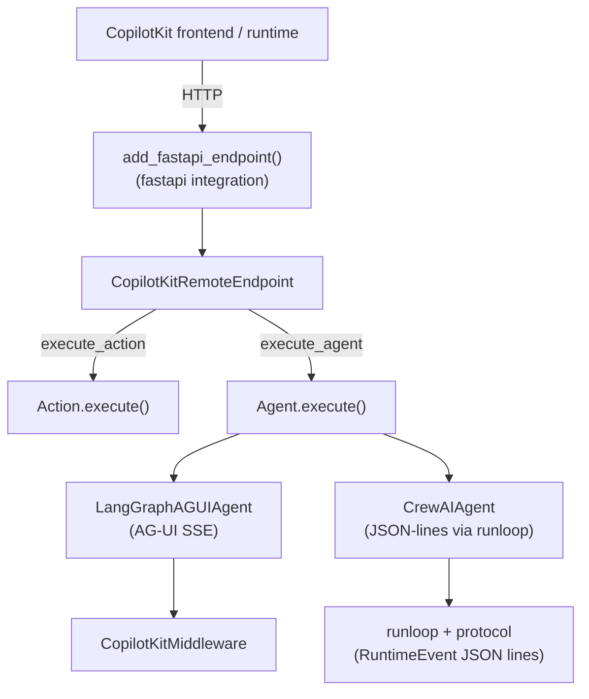

# sdk-python - overview

The **`copilotkit` Python SDK** — the agent-side library that exposes Python **actions** and **agents** (LangGraph, CrewAI, or fully custom) to a CopilotKit frontend/runtime over HTTP. It is the Python sibling of [[@copilotkit/sdk-js]].

- **Published name:** `copilotkit` (PyPI). **Version:** `0.1.90` (`pyproject.toml`, Poetry). This is an **independent release track** with its own version scheme — it is *not* part of the monorepo's `@copilotkit/*` v1.57.4 JavaScript packages.
- **Build:** Poetry (`poetry-core` build backend). Python `>=3.10,<3.15`. `py.typed` shipped (typed package).
- **Tests:** `pytest` (dev dependency group); `tests/` directory at the SDK root.

## Install & extras

```bash
pip install copilotkit            # LangGraph + FastAPI baseline
pip install "copilotkit[crewai]"  # adds the optional CrewAI integration
```

Core runtime deps: `langgraph >=0.3.25,<2`, `langchain >=0.3.0`, `ag-ui-langgraph >=0.0.35` (with `fastapi` extra), `ag-ui-protocol >=0.1.15`, `fastapi`, `partialjson` (streaming JSON parser used by predict-state), `toml`. `crewai >=0.118.0` is the optional extra (capped at Python `<3.14`).

## Top-level exports (`copilotkit/__init__.py`)

- [[sdk-python - CopilotKitRemoteEndpoint & SDK]] — `CopilotKitRemoteEndpoint` (+ deprecated `CopilotKitSDK` alias), `CopilotKitContext` / `CopilotKitSDKContext`.
- [[sdk-python - Action/Agent/Parameter]] — `Action`, `Agent`, `Parameter`.
- [[sdk-python - LangGraphAGUIAgent]] — `LangGraphAGUIAgent`.
- [[sdk-python - CopilotKitMiddleware]] — `CopilotKitMiddleware`.
- [[sdk-python - CopilotKitState]] — `CopilotKitState`.
- [[sdk-python - header_propagation]] — `set_forwarded_headers`, `get_forwarded_headers`, `install_httpx_hook`.
- Re-exported from `ag_ui_langgraph`: `StateStreamingMiddleware`, `StateItem`.
- `CrewAIAgent` is declared in `__all__` but imported lazily from the optional [[sdk-python - crewai integration]] subpackage.

## Two transports / two protocols

The SDK predates and overlaps with [[AG-UI Protocol]]. There are effectively **two paths**, and which one runs depends on the agent class:

1. **AG-UI path (current).** [[sdk-python - LangGraphAGUIAgent]] extends `ag_ui_langgraph.LangGraphAgent` and streams native AG-UI SSE events. This is the path used by modern LangGraph agents and by [[sdk-python - CopilotKitMiddleware]].
2. **Custom JSON-lines path (legacy/CrewAI).** [[sdk-python - protocol (RuntimeEvent types)]] defines CopilotKit's *own* event vocabulary (`RuntimeEventTypes`) serialized as newline-delimited JSON, pumped by [[sdk-python - runloop]]. [[sdk-python - crewai integration]] and the v1 FastAPI agent route use this path.

Both are served through [[sdk-python - fastapi integration]] (`add_fastapi_endpoint`), whose handler exposes both a v2 route table (`/agent/{name}`, `/agent/{name}/state`, `/action/{name}`) and v1 fallbacks (`/info`, `/agents/execute`, `/agents/state`, `/actions/execute`).



## Notable footguns / corrections

- The **README is stale**: its `from copilotkit import Copilot` quick-start references a class that does not exist. The real entry point is `CopilotKitRemoteEndpoint`.
- `copilotkit.langchain` is a **deprecated** shim that re-exports everything from `copilotkit.langgraph` and warns on import.
- `CopilotKitSDK` is **deprecated** (since 0.1.31) in favor of `CopilotKitRemoteEndpoint`.
- `langgraph.json` references a `./copilotkit/demos/autotale_ai/agent.py:graph` graph, but **no `demos/` directory exists** in the shipped package — a leftover config entry.
- There are **two unrelated `CopilotKitState` / `CopilotKitProperties`** definitions: the LangGraph one ([[sdk-python - CopilotKitState]]) and a CrewAI `FlowState`-based one inside [[sdk-python - crewai integration]]. They share names but live in different modules.

## Related

[[SDK-Python MOC]] · [[@copilotkit/sdk-js]] · [[AG-UI Protocol]] · [[A2UI (Generative UI)]] · [[Middleware]] · [[Multi-Agent]]
