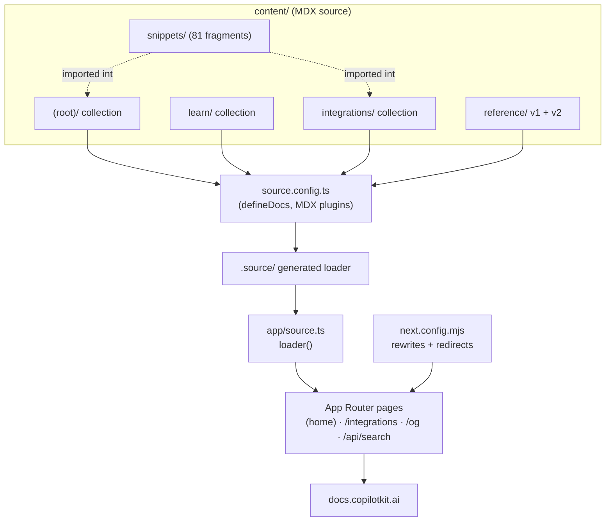

# Docs-Site MOC

Map of Content for the **public documentation site** (`docs/`) and the **internal architecture guides** (`dev-docs/`). The public site is a [Next.js](https://nextjs.org) app served at `docs.copilotkit.ai`, built on **Fumadocs** (a docs framework for Next App Router). The internal `dev-docs/architecture/` set is plain Markdown for engineers, not built or deployed.

> The published `docs/package.json` still names the app `fumadocs-test` (v0.0.0, private) and its README is the unmodified Create-Fumadocs starter text — neither reflects the real deployment. Treat both as stale scaffolding. The app pins `@copilotkit/react-core` / `@copilotkit/react-ui` at **1.10.6** (an old marketing-site version, unrelated to the monorepo's v1.57.4).

## Notes in this folder

- [[docs - Fumadocs setup]] — the Fumadocs/MDX engine: `source.config.ts`, `app/source.ts`, the App Router layouts, MDX component map, and remark/rehype plugins.
- [[docs - content collections (root/learn/integrations/reference)]] — the four MDX content trees under `content/docs/` and how route groups, rewrites and dynamic routes map them to URLs.
- [[docs - navigation (meta.json)]] — how sidebar order, separators, spread (`...`) entries, `root` boundaries and the `patch-pagetree`/redirect machinery build the navigation tree.
- [[docs - snippets]] — the 81 reusable MDX fragments under `snippets/`, how they are imported, and the snippet TOC merge.
- [[docs - build & deploy]] — predev/prebuild scripts, integration-feature generation, broken-link checking, redirects/rewrites, sitemap, OG images, analytics, and Vercel/LFS deployment.
- [[dev-docs - architecture guides]] — the eight internal Markdown engineering guides under `dev-docs/architecture/`.

## How the pieces fit

Related architecture concepts documented elsewhere in the vault: [[Three-Layer Architecture]], [[AG-UI Protocol]], [[Request Lifecycle]], [[Intelligence Platform vs SSE]], [[Multi-Agent]], [[Middleware]], [[@copilotkit vs @copilotkitnext]]. The public docs themselves describe `@copilotkit/react-core`, `@copilotkit/react-ui` and `@copilotkit/runtime`; the reference section is generated from those packages.
