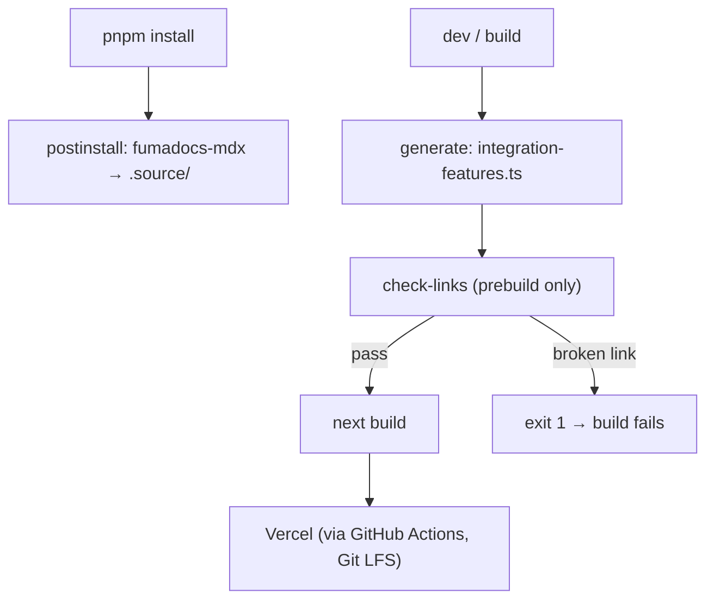

# docs - build & deploy

How the docs site is generated, validated and shipped. Part of the [[Docs-Site MOC]]. The app is **not** an Nx project — it builds standalone with the `next` CLI (`build`, `dev`, `start`) on Vercel.

## Pre-build / pre-dev pipeline

`docs/package.json` chains generators around the Next commands:

| Hook | Runs |
| --- | --- |
| `postinstall` | `fumadocs-mdx` — compiles `content/` into the generated `.source/` module |
| `predev` | `npm run generate` |
| `prebuild` | `npm run generate && npm run check-links` |
| `generate` | `node scripts/generate-integration-features.mjs` |
| `check-links` | `node scripts/check-broken-links.js` |
| `verify-broken-links` | `node scripts/verify-broken-links.js` |

**`generate-integration-features.mjs`** scans `content/docs/integrations/` and, for a fixed `FEATURES` list (`shared-state`, `generative-ui` and its sub-features, `frontend-actions`, `human-in-the-loop`, `agentic-chat-ui`, `custom-look-and-feel`), records which integration directories contain that feature (as a folder or `<feature>.mdx`). It writes the auto-generated `lib/integration-features.ts` (`INTEGRATION_FEATURES` map + `hasIntegrationFeature()`), driving feature badges/grids in the UI. Adding a feature page to an integration auto-registers it on the next build.

**`check-broken-links.js`** walks every `.mdx` in `content/docs` and every `.tsx/.jsx` in `components/`, extracts markdown links and JSX `href`s, and validates each against the set of real pages — replicating Fumadocs routing in `filePathToUrl()` (strips route groups like `(root)`, drops the `integrations/` prefix, folds `index.mdx`). It loads and executes `next.config.mjs`'s `redirects()` so a link that resolves through a redirect is accepted. Exit code 1 on any broken link, which fails `prebuild`. `verify-broken-links.js` is a companion checker.

## Routing config (next.config.mjs)

`next.config.mjs` wraps the app with `createMDX()` and defines:
- **`rewrites().beforeFiles`** — PostHog reverse-proxy (`/ingest/*` → PostHog EU, to dodge ad-blockers), `/guides/* → /built-in-agent/guides/*`, each `/<framework>/* → /integrations/<framework>/*`, and `/agentcore/* → /deploy/agentcore/*`.
- **`redirects()`** — auto folder redirects from `generateFolderRedirects()` (see [[docs - navigation (meta.json)]]) **combined** with a long list of manual legacy redirects (`/coagents/*`, `/shared/*`, LangGraph-specific paths). `middleware.ts` adds further runtime redirects for old/broken paths.

## Generated routes & SEO

- **Search:** `app/api/search/route.ts` builds a Fumadocs `"advanced"` search index from `source.getPages()` (title, description, structuredData, url).
- **Sitemap:** `app/sitemap.ts` emits `/` plus every `source.getPages()` URL (base URL from `VERCEL_URL` or localhost).
- **OG images:** `app/og/[...slug]/route.tsx` renders per-page Open Graph images via `next/og` `ImageResponse` (Inter fonts fetched from gstatic, `cache: force-cache`). Skipped during the production-build phase (`NEXT_PHASE === "phase-production-build"`). `vercel.json` grants `app/og/**` a 60s `maxDuration`.
- **Analytics:** PostHog (`posthog-js` + the `/ingest` proxy), GA4 (`react-ga4`), HubSpot, reb2b and Reo scripts injected in `app/layout.tsx`.

## Deployment

`vercel.json` sets `buildCommand: "next build"` and configures the image optimizer (allowed domains incl. `docs.copilotkit.ai`, github user-asset S3, gstatic). Per the README, docs assets are tracked with **Git LFS**, so production builds must run through a GitHub Actions workflow to get real bytes (not LFS pointers); required secrets are `VERCEL_TOKEN`, `VERCEL_ORG_ID`, `VERCEL_PROJECT_ID_DOCS`, and automatic Git-based Vercel deploys should be disabled in favor of the workflow.

> **Verification note:** the README names `deploy_docs_vercel.yml` / `deploy_docs_vercel_preview.yml`, but the workflows present in `.github/workflows/` are `showcase_docs-sync.yml` and `test_integration-docs.yml` — the named deploy workflows are not in this worktree, so the LFS/secrets deploy story is documented from the (stale) README and could not be confirmed against an actual workflow file. The repo-wide CI is catalogued under 07-Build-CI-Release.

