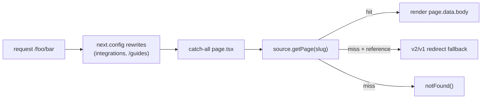

# docs - content collections (root/learn/integrations/reference)

All published prose lives under `docs/content/docs/` as MDX — **641 `.mdx` files** in one Fumadocs collection (defined in [[docs - Fumadocs setup|source.config.ts]]). The top-level `content/docs/meta.json` (`"root": true`) is the master ordering. Four logical trees sit beneath it; navigation order is governed by [[docs - navigation (meta.json)]]. Part of the [[Docs-Site MOC]].

## (root) — the main product docs

Folder `content/docs/(root)/` is a **Fumadocs route group**: the parentheses are stripped from the URL, so `(root)/quickstart.mdx` serves at `/quickstart`. It holds the core product surface — getting started (`index`, `quickstart`, `build-with-agents`), basics (`prebuilt-components`, `custom-look-and-feel`, `programmatic-control`, `multimodal-attachments`, `inspector`, `vs-code-extension`), app control (`frontend-tools`, `shared-state`, `threads`), and subtrees `generative-ui/`, `backend/`, `deploy/`, `premium/`, `migration-guides/`, `troubleshooting/`, plus an `(other)/` route group (`contributing/`, `telemetry/`). These pages document [[@copilotkit/react-core]], [[@copilotkit/react-ui]] and [[@copilotkit/runtime]] usage, and concepts like [[Tools (Frontend & Backend)]], [[Context]], [[Threads]], [[Suggestions]] and [[A2UI (Generative UI)]].

## learn/ — conceptual material

`content/docs/learn/` (`"root": true`) is the explanatory tree: `index`, `whats-new/`, the protocol pages (`agentic-protocols`, `ag-ui-protocol`, `connect-mcp-servers`, `a2a-protocol`), `generative-ui/`, architecture (`architecture`, `threads`, `intelligence-platform`), and `tutorials/`. Its meta also injects **cross-tree shortcut links** into other collections (tutorials, videos, cookbook). Maps to vault concepts [[AG-UI Protocol]], [[A2UI (Generative UI)]], [[Intelligence Platform vs SSE]], [[Three-Layer Architecture]].

## integrations/ — one subtree per agent framework

`content/docs/integrations/` documents 14 framework integrations: `built-in-agent`, `langgraph`, `deepagents`, `adk`, `microsoft-agent-framework`, `aws-strands`, `mastra`, `pydantic-ai`, `crewai-flows`, `agno`, `ag2`, `agent-spec`, `llamaindex`, `a2a` (canonical order in `lib/integrations.ts` `INTEGRATION_ORDER`). Each may carry feature subpages (`shared-state`, `generative-ui/*`, `human-in-the-loop`, `custom-look-and-feel`, …) that the build scans into `lib/integration-features.ts` (see [[docs - build & deploy]]).

This tree is special-cased twice:
1. **Dedicated route** — `app/integrations/[[...slug]]/page.tsx` renders it (separate from the `(home)` catch-all) and calls `source.getPage(["integrations", ...slug])`.
2. **URL rewrites** — `next.config.mjs` `rewrites().beforeFiles` maps each framework's clean URL (e.g. `/langgraph/:path*`) to `/integrations/langgraph/:path*`, so the public URL omits the `integrations/` segment. `/guides/*` rewrites to `/built-in-agent/guides/*`.

The built-in-agent integration corresponds to the [[runtime - BuiltInAgent]]; LangGraph maps to the [[@copilotkit/sdk-js]] and Python SDK paths.

## reference/ — the API reference (v1 + v2)

`content/docs/reference/` (`"root": true`) splits by API generation:
- **`reference/v2/`** — current API. UI `components/` (`CopilotKit`, `CopilotChat`, `CopilotChatView/MessageView/Input/UserMessage/AssistantMessage`, `CopilotPopup`, `CopilotSidebar`) and `hooks/` (`useAgent`, `useAgentContext`, `useCapabilities`, `useComponent`, `useConfigureSuggestions`, `useCopilotChatConfiguration`, `useCopilotKit`, `useDefaultRenderTool`, `useFrontendTool`, `useHumanInTheLoop`, `useInterrupt`, `useRenderTool`, `useRenderToolCall`, `useSuggestions`, `useThreads`). These document [[@copilotkit/react-core]] V2.
- **`reference/v1/`** — legacy API. `components/` (`CopilotKit`, `CopilotTextarea`, `chat/`), `hooks/` (`useCopilotAction`, `useCoAgent`, `useCoAgentStateRender`, `useCopilotReadable`, `useCopilotChat`, `useLangGraphInterrupt`, …), `classes/` (`CopilotRuntime`, `CopilotTask`, `llm-adapters/`), and `sdk/` (`js/`, `python/`). These document the [[@copilotkit/runtime]] V1 layer, [[@copilotkit/sdk-js]] and the Python SDK.

The `(home)` page has a **legacy-reference fallback**: a `/reference/...` URL without a `v1`/`v2` segment is `redirect()`-ed to v2 if it exists, else v1.

## How a slug becomes a page

The matching route-group / rewrite rules are mirrored in the build-time link checker's `filePathToUrl()` so that broken links are caught — see [[docs - build & deploy]].
