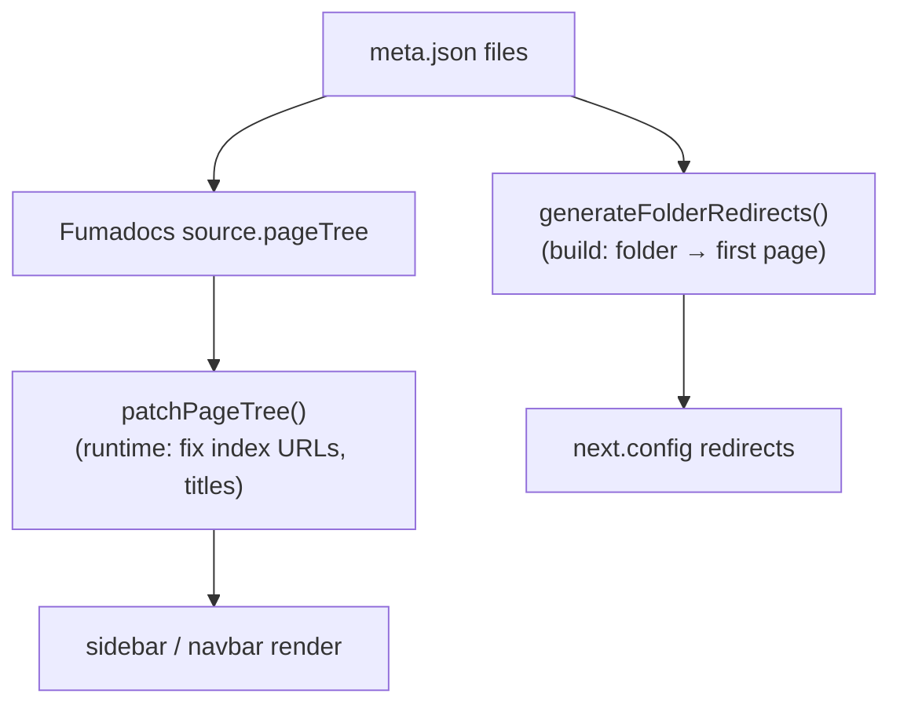

# docs - navigation (meta.json)

Sidebar structure and page ordering are declared in **`meta.json`** files co-located with the MDX, the Fumadocs convention. Fumadocs reads them through the `meta` collection (see [[docs - Fumadocs setup]]) and assembles `source.pageTree`, which the layouts render. Part of the [[Docs-Site MOC]].

## meta.json grammar

Each `meta.json` has a `title` and a `pages` array. Entry forms used in this repo:

- **`"index"` / `"quickstart"`** — a page slug, in display order.
- **`"---Getting Started---"`** — a separator that renders as a non-clickable section heading.
- **`"...(root)"` / `"...generative-ui"`** — a **spread** that inlines all pages of a subfolder (or route group) at that position.
- **`"[Tutorial: AI Todo App](../direct-to-llm/tutorials/...)"`** — an inline external/cross-tree link (used heavily in `learn/meta.json`).
- **`"root": true`** — marks a folder as a navigation **boundary**: when a user is inside it, the sidebar scopes to that subtree. Set on `content/docs/meta.json`, `learn`, `integrations` (root flag in master meta), and `reference`.

## The four governing files

- **`content/docs/meta.json`** (master, `root: true`) — top-level order: `...(root)`, then `reference`, `learn`, an `---Integrations---` separator, `...integrations`, then the individual framework folders.
- **`content/docs/(root)/meta.json`** — the product-docs spine, grouped by `---Getting Started---`, `---Basics---`, `---Generative UI---`, `---App Control---`, `---Backend---`, `---Deploy---`, `---Premium Features---`, `---Platforms---`, `---Migration Guides---`, `---Troubleshooting---`, `---Other---`.
- **`content/docs/learn/meta.json`** — concept order plus cross-tree shortcut links.
- **`content/docs/integrations/meta.json`** — must mirror `INTEGRATION_ORDER` in `lib/integrations.ts` (a comment in that file enforces the contract).
- **`content/docs/reference/meta.json`** — just `["v2","v1"]`; each version's own `meta.json` orders Components / Hooks / Classes / SDKs.

## Two patching layers on top of meta.json

Fumadocs v16 doesn't always derive an index URL for `root` folders, and the integration URLs are rewritten. Two pieces of glue fix this:

**1. `lib/patch-pagetree.ts` — runtime tree patch.** `patchPageTree(source.pageTree)` (called in `app/(home)/layout.tsx`) walks the tree and, for folders missing an `index.url`:
- maps special folder names to integration IDs (`FOLDER_NAME_TO_INTEGRATION_ID`, e.g. `AutoGen2 → ag2`);
- matches a folder to `INTEGRATION_METADATA` by label/id and sets its index to the integration `href`;
- handles non-integration roots via `ROOT_FOLDER_INDEX_URLS` (e.g. `Learn → /learn`);
- otherwise, if a folder has exactly one page child, points the folder at that child;
- applies `FOLDER_TITLE_OVERRIDES` (e.g. renaming a folder to "Declerative Gen-UI (A2UI)" — sic, the typo is in source).

**2. `next.config.mjs` `generateFolderRedirects()` — build-time redirects.** Scans `content/docs` for folders that have a `meta.json` but **no `index.mdx`**, and emits a permanent redirect from the folder URL to its first real page (skipping separators and spread entries). This is combined with a large block of manual redirects (legacy `/coagents/*`, `/shared/*`, LangGraph paths, etc.) plus `middleware.ts` redirects.

Because navigation, rewrites and redirects are all derived from these `meta.json` files, the [[docs - build & deploy|broken-link checker]] re-implements the same path normalization to validate links before deploy.
