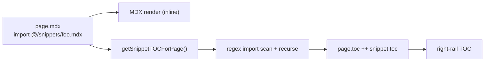

# docs - snippets

`docs/snippets/` holds **reusable MDX fragments** (about **81 `.mdx` files**) imported into pages so that install steps, provider-setup blocks and integration boilerplate stay DRY across the 600+ content pages. Part of the [[Docs-Site MOC]].

## Layout

Top-level snippets cover cross-cutting setup, e.g. `install-sdk.mdx`, `install-python-sdk.mdx`, `copilot-runtime.mdx`, `copilot-ui.mdx`, `headless-ui.mdx`, `find-your-copilot-runtime.mdx`, `llm-adapters.mdx`, `use-agent.mdx`, `use-client-callout.mdx`, the self-hosting set (`self-hosting-copilot-runtime-*.mdx`), and the cloud-config set (`copilot-cloud-configure-*.mdx`).

Subfolders group by area:
- `snippets/shared/` — `app-control`, `backend`, `basics`, `contributing`, `generative-ui`, `guides`, `migration-guides`, `premium`, `reference`, `threads`, `troubleshooting` (plus loose files like `coding-agents.mdx`, `performance-tip.mdx`, `generative-ui-specs-overview.mdx`).
- `snippets/integrations/` — per-framework fragments: `adk`, `agent-spec`, `agentcore`, `agno`, `aws-strands`, `deepagents`, `langgraph`, `llamaindex`, `mastra`, `microsoft-agent-framework`, `pydantic-ai`.
- `snippets/cloud/` and `snippets/coagents/` — CopilotCloud and LangGraph-agent provider-setup blocks.

## How snippets are imported

A page imports a snippet as a default MDX export and renders it inline:

```mdx
import InstallSDK from "@/snippets/install-sdk.mdx";

<InstallSDK />
```

The `@/snippets/...` path alias is the contract the tooling keys off (see below). Because snippets are full MDX, they can themselves use the [[docs - Fumadocs setup|MDX component map]] (`Tabs`, `Steps`, `Callout`, `remarkInstall` package-manager tabs, etc.) and import **other** snippets (nested imports are supported).

## Snippet table-of-contents merge

A snippet's own headings would otherwise be missing from the page TOC. `lib/snippet-toc.ts` fixes this:

- `getSnippetTOCForPage(slug)` resolves the page's source `.mdx` (trying both `content/docs/...` and `content/docs/(root)/...`, `index.mdx` and `<slug>.mdx`).
- `extractSnippetTOC(content)` scans for `import X from "@/snippets/<path>.mdx"`, reads each referenced file, strips its frontmatter, runs Fumadocs `getTableOfContents` on the body, and recurses into nested imports (guarded by a `processed` `Set`). Missing files are silently skipped.

Both `[[...slug]]/page.tsx` pages call this and **concatenate** the snippet TOC onto `page.data.toc` (unless `hideTOC` frontmatter is set), so the right-rail "On this page" includes headings that physically live in snippets. The integrations page passes a slug prefixed with `"integrations"` to match its rewritten routing.


