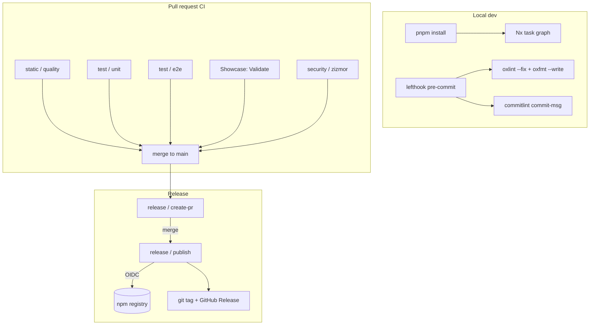

# Build-CI-Release MOC

Map of everything that builds, validates, versions, and ships the CopilotKit monorepo. The repo is an [[Nx configuration|Nx]] + [[pnpm workspace]] monorepo with a Rust-based lint/format toolchain (oxlint/oxfmt), git hooks via [[lefthook (git hooks)|lefthook]], [[commitlint]] enforcement, and a custom TypeScript release pipeline that publishes to npm over [[npm OIDC publishing|OIDC trusted publishers]] across **two release tracks** (monorepo `v*` and Angular `angular/v*`).

> **Source-of-truth note:** there is a [[changesets & release.config|.changeset/]] directory present, but releases are **not** driven by the Changesets tool — they are driven by the bespoke `scripts/release/*` pipeline keyed off `release.config.json`. The changeset files are human-authored release-note fragments.

## Toolchain & workspace
- [[Nx configuration]] — task graph, caching, target defaults (`nx.json`).
- [[pnpm workspace]] — workspace globs, dependency overrides, `.npmrc`, `.pnpmfile.cjs`.
- [[Root scripts & toolchain]] — root `package.json` scripts, oxlint/oxfmt, tsdown, vitest, engines.

## Git hooks & commits
- [[lefthook (git hooks)]] — pre-commit / commit-msg hook orchestration.
- [[commitlint]] — Conventional Commits enforcement.

## Release
- [[changesets & release.config]] — `release.config.json` scopes + the `.changeset/` fragments.
- [[Release pipeline (prepare/publish/prerelease)]] — the `scripts/release/*` TypeScript pipeline.
- [[npm OIDC publishing]] — token-free publishing via GitHub Actions OIDC + `npx npm@11`.

## CI workflows (37 total)
- [[CI workflows - testing]] — unit, integration, e2e, smoke, python-sdk.
- [[CI workflows - static & security]] — quality (oxfmt/oxlint/publint/attw/commitlint), binaries, danger, zizmor, fork-PR alert.
- [[CI workflows - showcase]] — showcase build/deploy/validate/eval/previews/docs-sync.
- [[CI workflows - release & dependabot]] — release create-PR/publish/prerelease/publish-commit + Dependabot automation.

## Repo-management scripts & assets
- [[codemods (migrate-attachments)]] — jscodeshift migration codemod.
- [[scripts (release/qa/doc-tests/hooks)]] — the rest of `scripts/` (qa harnesses, doc-tests, hooks, validators).
- [[community (Hacktoberfest demos)]] — `community/` demo submissions.
- [[assets]] — top-level `assets/` media + license badge.

