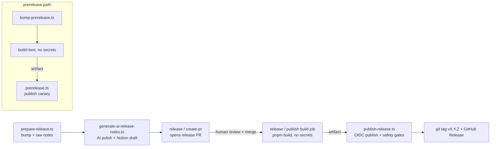

# Release pipeline (prepare/publish/prerelease)

A bespoke TypeScript release pipeline under `scripts/release/`, run with `tsx`. It supersedes Changesets-driven versioning (the [[changesets & release.config|.changeset/]] fragments are notes only). Configured by `release.config.json` (`monorepo` + `angular` scopes). Publishes via [[npm OIDC publishing]] from the workflows in [[CI workflows - release & dependabot]].

## Shared lib (`scripts/release/lib/`)
- **`config.ts`** — `ROOT`, `loadConfig()`, `getScopeConfig(scope)`. `ReleaseScope = "monorepo" | "angular"`.
- **`versions.ts`** — the version engine:
  - `getCurrentVersion(scope)` reads the scope's `versionSource` package.json.
  - `parseSemver` / `computeNextStableVersion` (a prerelease collapses to its base `x.y.z`; otherwise patch/minor/major bump) / `computePrereleaseVersion` (`x.y.z-canary.<suffix|unixSeconds>`).
  - `getPackagesForScope(scope)` scans `packages/*/package.json` for names in the scope.
  - `bumpPackages(scope, version)` writes new versions and, for `sharedVersion` scopes, rewrites internal `@copilotkit/*` dep pins (skipping `workspace:*`).
- **`changes.ts`** — `getLastReleaseTag()` (latest `vX.Y.Z`), `getCommitsSinceLastRelease()`, `getChangesSummary()` from `git log`.
- **`notion.ts`** — `createReleaseDraft(version, md)` / `readReleaseDraft(pageId)` via the Notion REST API (markdown ⇄ Notion blocks).

## 1. `prepare-release.ts` — bump + raw notes (in `release / create-pr`)
`--bump <patch|minor|major> --scope <monorepo|angular> [--dry-run]`.
Computes the next stable version, calls `bumpPackages`, generates **raw** release notes (groups commits into Features/Fixes/Other by `feat:`/`fix:` prefix) into `release-notes.md`, and emits `version=` / `scope=` to `$GITHUB_OUTPUT`.

## 2. `generate-ai-release-notes.ts` — polish + Notion draft
`<version>`. If `ANTHROPIC_API_KEY` is set, calls the Anthropic API (`claude-sonnet-4-20250514`) to rewrite `release-notes.md` into user-facing notes (falls back to raw on failure). If `NOTION_API_KEY` + `NOTION_RELEASE_NOTES_PAGE` are set, creates a Notion draft page and writes `release-notes-notion.json` (pageId/url) so the publish step can read human edits back.

## 3. `bump-prerelease.ts` — prerelease version bump (secrets-free build job)
`--scope … [--suffix …]`. Computes `x.y.z-canary.<id>` and writes it to package.json. Separated from publishing so version bumping + build happen in a job with **no** `NPM_TOKEN`.

## 4. `prerelease.ts` — publish prerelease (publish-only)
`--scope … [--dry-run]`. Reads the already-bumped version, then for each package runs `pnpm pack` + `npx --yes npm@11.15.0 publish <tarball> --tag canary --access public`. Does **not** rebuild/retest (keeps secrets out of the build tree).

## 5. `publish-release.ts` — publish stable (after release-PR merge)
`--scope …`. Safety-gated:
- Refuses any version with a prerelease suffix (stable must be clean `x.y.z`).
- `getPublishedVersion()` via `npm view`; aborts on network/auth errors, treats only `E404` as "not published".
- Refuses to publish unless the new version is **greater** than what's on npm.
- Optionally reads the (edited) Notion draft back into `release-notes.md`.
- For each package: skips it if already published at this version (idempotent retries), else `pnpm pack` + `npx --yes npm@11.15.0 publish --tag latest --access public`.
- Emits `version=`/`scope=` for the downstream git-tag + GitHub-Release steps.

Build is always performed in a **separate secrets-free job**; the publish job downloads the pre-built artifact and authenticates via OIDC (see [[npm OIDC publishing]]). The full release-script suite is unit-tested (`scripts/release/lib/versions.test.ts`, run in the `test / unit` workflow via `scripts/release/vitest.config.mts`).
